# CLAHE From First Principles

**Contrast Limited Adaptive Histogram Equalization**, built up one component at a time. Every component exists because the previous, simpler algorithm failed in a specific, visible way. The structure of this doc mirrors that history:

```
Histogram Equalization (HE)     → fails: one global mapping can't serve all regions
        + Adaptive (tiles)  = AHE → fails: amplifies noise, creates block seams
        + Contrast Limiting       → fixes noise amplification
        + Bilinear interpolation  → fixes block seams
        = CLAHE
```

All figures are generated by `clahe_walkthrough.py` (included). The from-scratch implementation at the end is **bit-exact** against `cv2.createCLAHE` — mean absolute difference of 0 over all 262,144 pixels.

Test image: `skimage.data.moon()` — 512×512, uint8, deliberately low-contrast.

---

## 1. The raw material: histogram and CDF

### The math

For an image with gray levels $v \in \{0, 1, \dots, L-1\}$ (here $L = 256$) and $N$ total pixels:

$$h(v) = \text{number of pixels with value } v \qquad p(v) = \frac{h(v)}{N} \qquad C(v) = \sum_{k=0}^{v} p(k)$$

- $h(v)$ — the **histogram**: raw counts per gray level.
- $p(v)$ — the histogram normalized into a probability distribution (PDF).
- $C(v)$ — the **cumulative distribution function**: the fraction of pixels with value $\leq v$. Monotonically non-decreasing, ends at exactly 1.

### The code

```python
hist = np.bincount(img.ravel(), minlength=256)   # h(v)
pdf  = hist / hist.sum()                         # p(v)
cdf  = np.cumsum(pdf)                            # C(v)
```

### The output

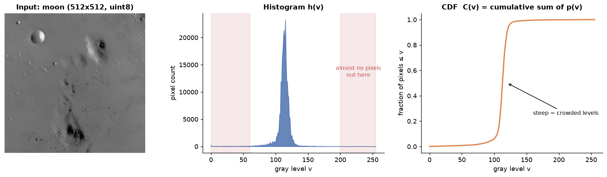

### Why this is the foundation

Look at the histogram: nearly all pixels are crammed into levels ~60–180. The levels 0–60 and 200–255 are almost empty (red bands). The image *has* an 8-bit container but is only *using* about half of it — that unused dynamic range is exactly the contrast we want to recover.

The CDF is the key object for everything that follows. Two properties matter:

1. **Where the histogram is tall, the CDF is steep.** The CDF's slope at $v$ *is* $p(v)$ (it's a cumulative sum, so its per-step increment is the PDF). Keep this in your head — "histogram height = CDF slope" is the single fact that explains both why equalization works and why CLAHE needs a clip limit.
2. **The CDF is monotonic and maps to $[0,1]$**, which makes it usable as a remapping function: multiply by 255 and it takes any input level to a valid output level *without ever reordering brightness* (a darker pixel never becomes brighter than a lighter one — edges and gradients keep their direction).

---

## 2. Global Histogram Equalization: the CDF *is* the transform

### The math

$$T(v) = \text{round}\big((L-1)\, C(v)\big)$$

Every pixel is remapped through this single lookup table (LUT): `output = T[input]`.

**Why does using the CDF as the transform flatten the histogram?** This is the probability integral transform. If a random variable $V$ has CDF $C$, then $U = C(V)$ is uniformly distributed on $[0,1]$. Intuition without the theorem: consider a crowded region of levels — many pixels, tall histogram, **steep CDF**. Steep CDF means consecutive input levels map to output levels that are *far apart* → the crowded levels get **stretched apart**. Sparse regions have a flat CDF → their levels get **squeezed together**. Stretching where crowded and squeezing where sparse is precisely histogram flattening. Nobody "designed" $T$; the image's own statistics generate it.

### The code

```python
T_global = np.round(255 * cdf).astype(np.uint8)   # build LUT from CDF
img_he   = T_global[img]                          # numpy fancy-indexing = apply LUT to every pixel
```

Two lines. Note the mechanism: an LUT application is $O(N)$ regardless of how the LUT was built — this stays true throughout CLAHE.

### The output

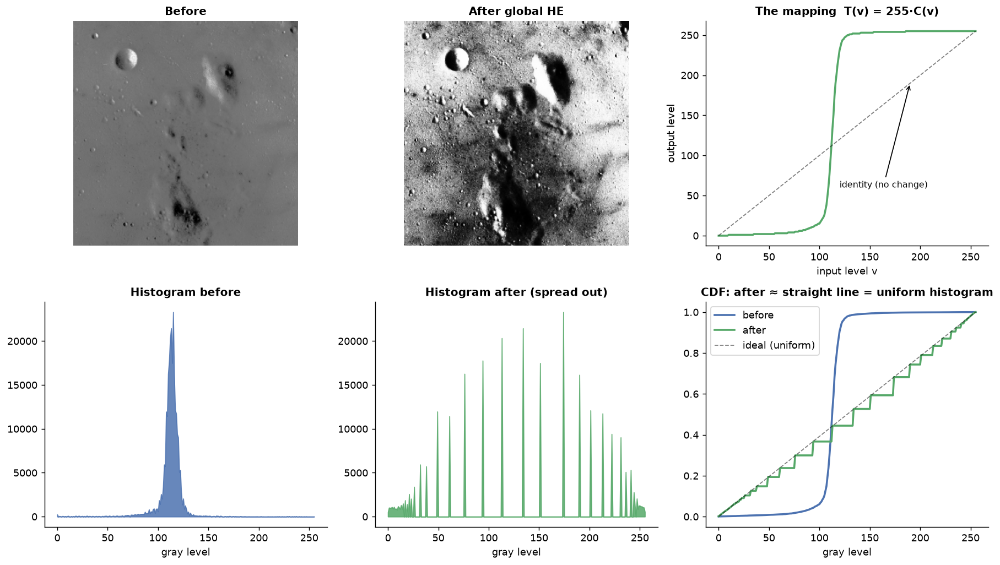

Read the top-right panel (the mapping $T$): it lies **above the identity line** for most of the range — dark/mid pixels get pushed brighter — and its slope exceeds 1 exactly where the input histogram was tall (levels ~90–150), which is the stretching in action. Bottom-right: the output CDF is nearly the ideal straight line, i.e. the output histogram is roughly uniform.

### Why it's not enough

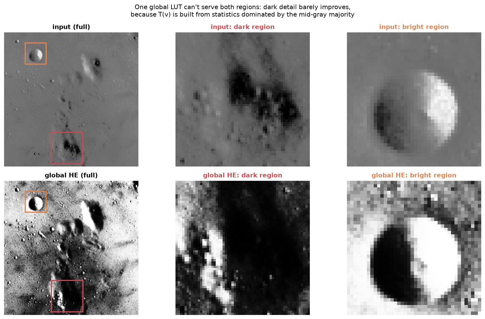

$T$ was built from **global** statistics, which are dominated by the mid-gray majority. The dark crater region (red box) contains detail spanning maybe levels 20–70 — but globally, few pixels live there, so $C(v)$ barely rises over that interval, so $T$ barely stretches it. The dark region's local contrast improves only marginally while the mid-tones consume the entire output range. **One mapping, built from everyone's statistics, serves no one's local needs.** This failure is what motivates the "A" in CLAHE.

---

## 3. Going local: tiling (the "Adaptive" part)

### The idea

If one global mapping fails because regions have different statistics, give each region its own mapping. Partition the image into a $G \times G$ grid of tiles (OpenCV default and ours: $8 \times 8$, so 64×64-pixel tiles here) and compute one histogram → one CDF → one LUT **per tile**.

### The code

```python
GRID = 8
th, tw = H // GRID, W // GRID          # tile height/width = 64x64
# tile centers — these become the anchor points for interpolation in step 6
cy = np.arange(GRID)*th + th//2
cx = np.arange(GRID)*tw + tw//2
```

### The output

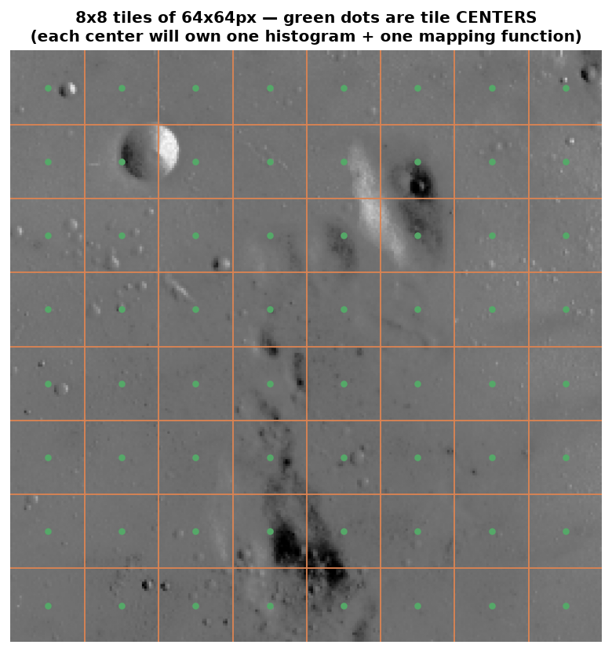

The green dots are **tile centers**. This matters for later: a tile's LUT is built from all 64×64 = 4096 pixels in the tile, but conceptually the LUT is "most correct" *at the tile's center* — that's the location the tile's statistics best represent. Step 6 (interpolation) leans entirely on this framing.

### Why tiles differ — and why tile size is a real tradeoff

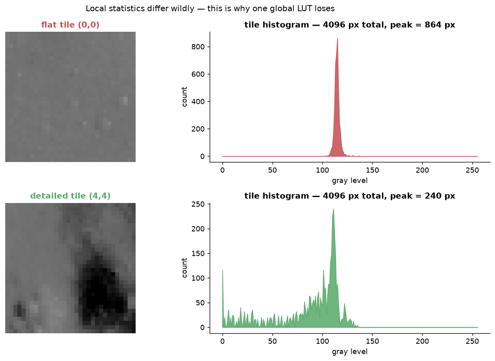

The flat sky tile (0,0) is a **massive spike** at one dark level — nearly all 4096 pixels at the same value. The crater tile (4,4) has a wide, structured distribution. These demand *completely different* mappings, which is the whole justification for going local.

Tile size is a bias–variance style tradeoff:
- **Smaller tiles** → more locally adapted, but each histogram is estimated from fewer pixels → noisier statistics → the mapping itself becomes unreliable.
- **Bigger tiles** → robust statistics, but you drift back toward the global-HE failure.

64×64 (4096 samples estimating 256 bins, ~16 samples/bin) is a reasonable middle; the parameter sweep in step 8 shows what happens at the extremes.

---

## 4. AHE: per-tile equalization — and its two failure modes

Apply step 2's equalization independently inside each tile (no clipping, no interpolation yet). This is plain **AHE** (Adaptive Histogram Equalization), and seeing it fail teaches you exactly why CLAHE's remaining two components exist.

### The code

```python
for ti in range(GRID):
    for tj in range(GRID):
        t = img[ti*th:(ti+1)*th, tj*tw:(tj+1)*tw]
        c = np.cumsum(np.bincount(t.ravel(), minlength=256)) / t.size
        out[ti*th:(ti+1)*th, tj*tw:(tj+1)*tw] = np.round(255*c).astype(np.uint8)[t]
```

### The output

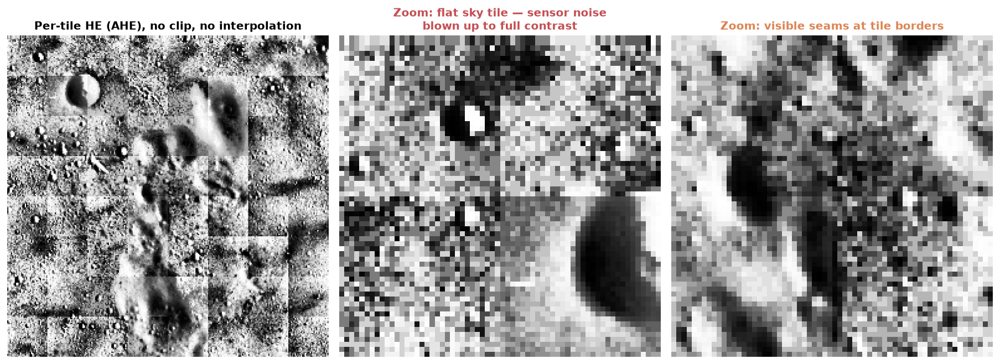

### Failure mode 1: noise amplification (why "Contrast Limited" exists)

The flat sky tile is now a snowstorm. Trace the mechanism through the chain from step 1:

> flat region → all pixels near one level → **one enormous histogram spike** → CDF jumps nearly 0→1 across a few levels → **near-vertical LUT** → two pixels differing by 1–2 levels of *sensor noise* get mapped ~100+ output levels apart.

Equalization cannot distinguish "signal variance" from "noise variance" — it stretches whatever variation exists. In a flat tile, the only variation *is* noise, so noise gets stretched to full contrast. In your SDA context this is the classic dark-sky-background problem: mostly-empty frames are exactly the flat-tile worst case.

### Failure mode 2: block seams (why interpolation exists)

Neighboring tiles have different histograms → different LUTs → the *same input gray level* maps to *different outputs* on either side of a tile border. The remapping function is **discontinuous in space**, so the eye sees a grid of seams even where the underlying image is smooth.

---

## 5. Contrast limiting: clip + redistribute

### The idea, derived rather than asserted

From step 1: **LUT slope at $v$ = CDF slope at $v$ = (scaled) histogram height at $v$.** The noise blowup was caused by an unbounded LUT slope, which was caused by an unbounded histogram peak. So: **cap the LUT's slope by capping the histogram's height.** That's the entire idea — the clip limit is a *slope limit in disguise*.

### The math

Ceiling per bin (OpenCV convention — the user-facing `clipLimit` is a *multiplier* over the uniform histogram height):

$$\beta = \max\!\Big(\Big\lfloor \frac{\alpha \cdot N_{\text{tile}}}{L} \Big\rfloor,\ 1\Big)$$

where $\alpha$ = `clipLimit` (default 2.0 here, or 40.0 in OpenCV's default constructor), $N_{\text{tile}} = 4096$, $L = 256$. A perfectly uniform tile histogram would have $N_{\text{tile}}/L = 16$ pixels per bin, so $\alpha = 2$ means "no bin may hold more than 2× the uniform share" → $\beta = 32$. Equivalently: **the local mapping may steepen contrast by at most a factor of $\alpha$ over identity.**

Clip, then redistribute:

$$E = \sum_{v} \max\big(h(v) - \beta,\ 0\big) \qquad \tilde h(v) = \min\big(h(v), \beta\big) + \frac{E}{L}$$

- $E$ — the total "excess" pixel mass sitting above the ceiling.
- **Why redistribute instead of discard?** The CDF must still end at 1 (equivalently, $\sum \tilde h = N_{\text{tile}}$), otherwise the LUT wouldn't span the full output range and you'd waste dynamic range. So the clipped mass is poured back **uniformly** across all bins — raising the histogram's floor slightly everywhere, which nudges the LUT slope toward 1 (identity) in the sparse regions. Clipping trades "extreme stretch at the spike" for "a bit of gentle stretch everywhere."

### The code

```python
def clip_histogram(h, clip_limit_mult, n_px):
    ceiling = max(int(clip_limit_mult * n_px / L), 1)
    excess  = np.maximum(h - ceiling, 0).sum()   # E: mass above the ceiling
    h = np.minimum(h, ceiling)                   # cut the peaks
    h += excess // L                             # equal integer share per bin
    residual = excess - (excess // L) * L        # integer-division remainder...
    if residual:                                 # ...sprinkled +1 over evenly spaced bins
        step = max(L // residual, 1)
        h[np.arange(0, L, step)[:residual]] += 1
    return h, ceiling
```

(The `residual` fiddling is OpenCV's exact integer arithmetic — since $E/L$ is rarely a whole number, the remainder is dropped one pixel at a time onto evenly spaced bins so the count is conserved *exactly*. Note the one-pass redistribution can push some bins slightly above $\beta$ again; OpenCV accepts that rather than iterating, and matching this detail is what makes our output bit-exact.)

### The output — on the pathological flat tile

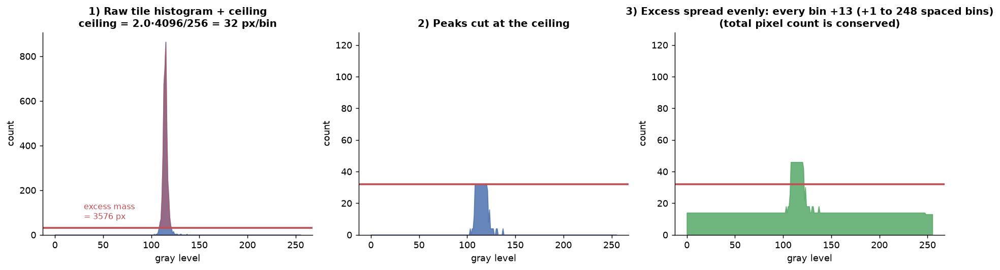

Left: the raw spike towers over the ceiling ($\beta = 32$, red line); the red-shaded area is the excess $E \approx 3900$ px. Middle: peaks cut. Right: excess poured back — every bin gains ~15, conserving the 4096-pixel total.

### The effect on the mapping function

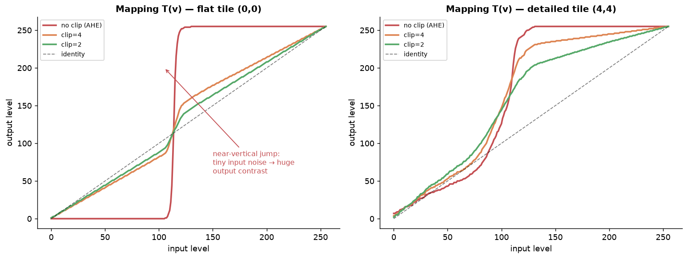

This figure is the heart of CLAHE — everything the clip limit does is visible here:

- **Flat tile (left):** the unclipped LUT (red) is a near-vertical cliff — the noise-amplification machine. Clipping at 2 (green) turns it into a bounded ramp near the identity line. Maximum slope is now provably $\leq \alpha \cdot$(slope of identity), because slope ∝ histogram height ≤ β.
- **Detailed tile (right):** the LUT was never extreme, so clipping barely changes it. **The clip limit is selective by construction** — it only intervenes where histograms spike, i.e., where the danger is.

So $\alpha$ is a contrast dial with meaningful endpoints: $\alpha = 1$ forces a fully uniform post-clip histogram → LUT = identity → no-op; $\alpha \to \infty$ → no clipping → raw AHE.

---

## 6. Bilinear interpolation: one smooth mapping field instead of 64 discontinuous ones

### The idea

The seams came from applying LUTs as spatial step functions. The fix reframes the problem: treat each tile's LUT as belonging to the tile's **center point** (the green dots from step 3), and for every pixel, **blend the LUTs of its 4 nearest tile centers** by distance. The applied mapping now varies *continuously* across the image — no borders, no seams.

### The math

For pixel $(x, y)$, express its position in "tile-center coordinates" (center of tile $k$ sits at $(k + \tfrac12) \cdot$ tile size):

$$f_y = \frac{y}{t_h} - \frac{1}{2}, \qquad y_0 = \lfloor f_y \rfloor, \quad y_1 = y_0 + 1, \quad w_y = f_y - y_0$$

(same for $x$). Then with $T_{ij}$ = the LUT of the tile centered at row $i$, column $j$:

$$\text{out}(x,y) = (1-w_y)(1-w_x)\,T_{y_0 x_0}[v] + (1-w_y)w_x\,T_{y_0 x_1}[v] + w_y(1-w_x)\,T_{y_1 x_0}[v] + w_y w_x\,T_{y_1 x_1}[v]$$

Component by component:
- **The $-\tfrac12$ offset** converts pixel coordinates into the lattice of tile *centers* (not tile corners). A pixel exactly on a center gets $w = 0$ toward it — that tile's LUT applies at full weight, which is exactly right since that's where the LUT is most valid.
- **The four weights sum to 1** — it's a convex combination, so the output stays inside the range of the four candidate outputs. No over/undershoot.
- **We interpolate LUT *outputs*, not pixels and not histograms.** Each pixel keeps its own value $v$; only the *function applied to it* is blended. Since each $T$ is monotonic and a convex combination of monotonic functions is monotonic, the blended mapping still never reorders brightness.
- **Edge handling:** indices are clamped to $[0, G-1]$; pixels outside the outermost centers get $w$ clipped to $\{0,1\}$, which degrades bilinear → linear (edges) → nearest (corners) automatically.

### The code

```python
fy = ys/th - 0.5;  fx = xs/tw - 0.5                     # tile-center coordinates
y0 = np.clip(np.floor(fy).astype(int), 0, GRID-1)       # nearest center above/left
y1 = np.clip(y0 + 1, 0, GRID-1)                         # nearest center below/right
wy = np.clip(fy - y0, 0, 1)                             # distance-based weight
# ... same for x0, x1, wx ...
v = img.astype(int)
out = ((1-wy)*(1-wx) * luts[y0, x0, v] + (1-wy)*wx * luts[y0, x1, v]
     +  wy*(1-wx)    * luts[y1, x0, v] +  wy*wx    * luts[y1, x1, v])
```

`luts[y0, x0, v]` is the trick worth internalizing: `y0`, `x0`, `v` are all H×W arrays, so this single fancy-index gathers, for every pixel simultaneously, "what the top-left tile's LUT would output for this pixel's value." Four gathers + weighted sum = fully vectorized CLAHE.

### The outputs

Which four centers a pixel blends, geometrically:

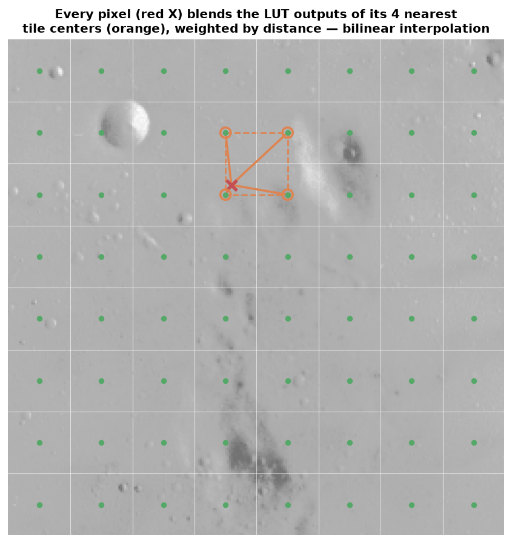

What the blend looks like in LUT space for that red-X pixel — four candidate curves collapsing into the one black curve actually applied:

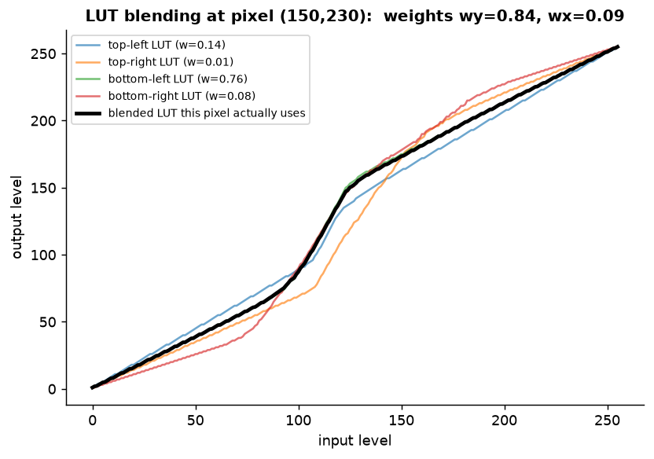

And the payoff — identical clipped LUTs, with vs. without interpolation:

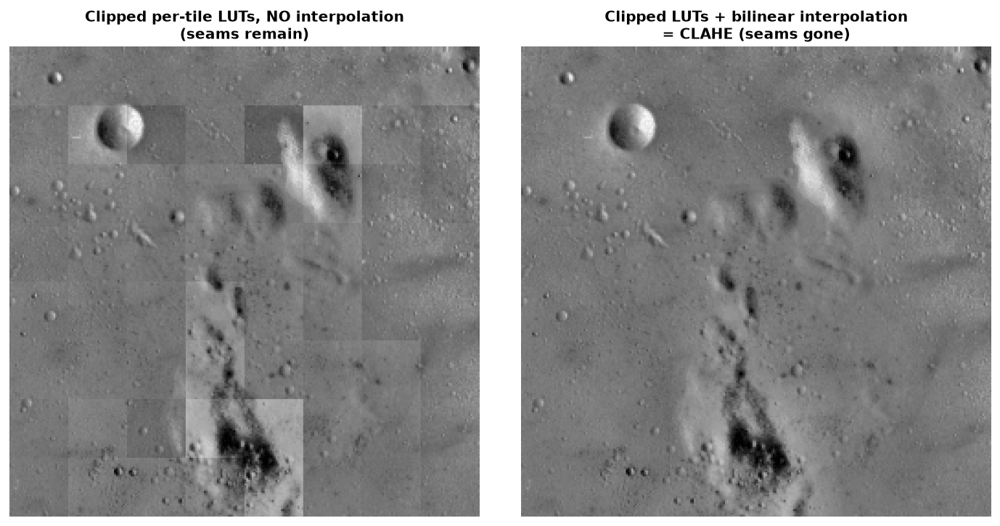

### Why bilinear specifically

It's the cheapest interpolation that is continuous in both axes: 4 lookups + 3 multiply-adds per pixel, and the weights depend only on position (precomputable). Higher-order schemes (bicubic over 16 centers) buy smoothness of *derivatives* that the eye can't see in a contrast mapping, at 4× the gathers. This cost profile is why CLAHE runs comfortably in real-time pipelines.

---

## 7. Full algorithm, assembled and validated

Everything above, in order:

```
1. Split image into G×G tiles
2. Per tile:  histogram → clip at β → redistribute excess → CDF → LUT
3. Per pixel: bilinearly blend the 4 nearest tile-center LUTs, applied at the pixel's value
```

Note what step 2 costs: histograms and LUTs are built once per *tile* (64 tiny 256-bin jobs), and step 3 is O(N) gathers. CLAHE ≈ the price of two passes over the image.

Validation against OpenCV (`clipLimit=2.0, tileGridSize=(8,8)`):

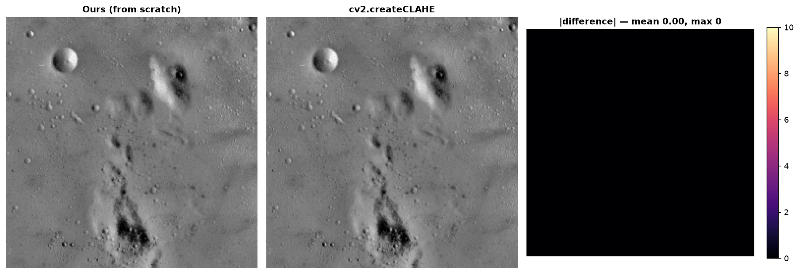

**Mean |difference| = 0.00, max = 0** — bit-exact, because we matched OpenCV's integer redistribution and its `floor(x + 0.5)` LUT rounding. The full journey:

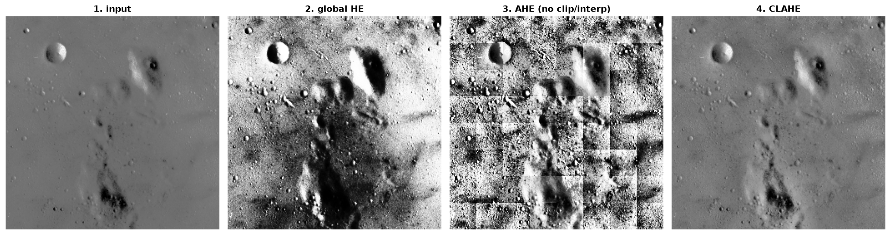

Compare panel 4 to panels 2 and 3: CLAHE recovers the crater detail that global HE left flat, *without* the snowstorm sky or the seams of AHE.

---

## 8. The two knobs, and how to reason about them

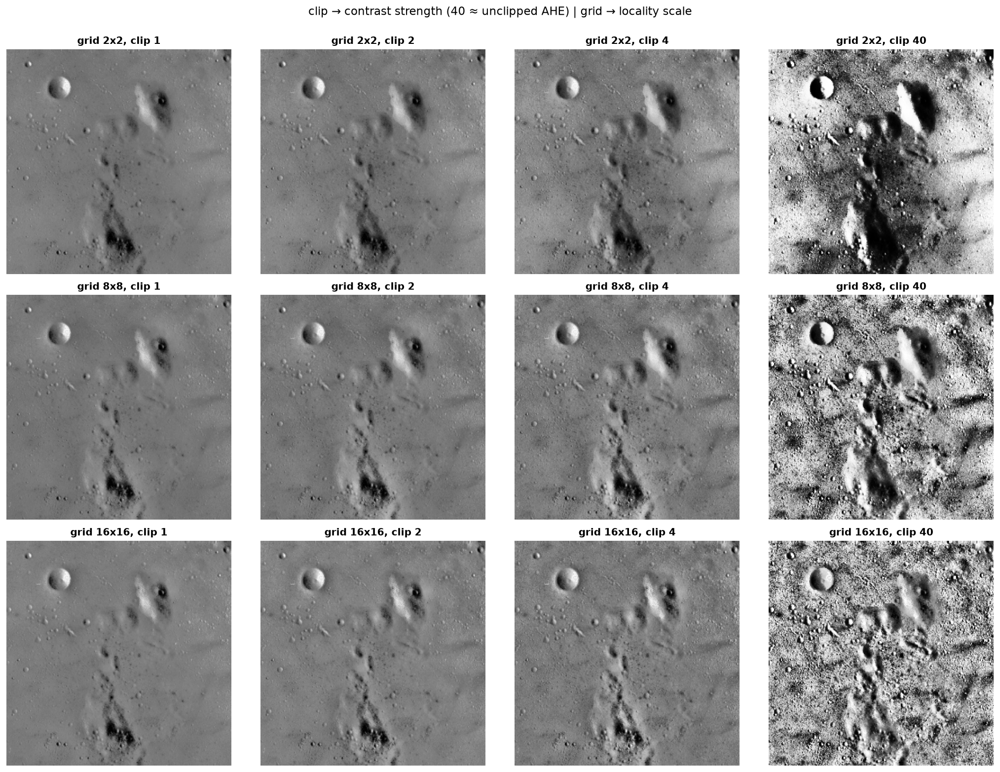

| Knob | Controls | Low end | High end |
|---|---|---|---|
| `clipLimit` ($\alpha$) | max local contrast gain (LUT slope cap) | 1 = identity (no-op) | ~40 ≈ unclipped AHE: noise blowup returns |
| `tileGridSize` ($G$) | spatial scale of adaptation | 2×2 ≈ global HE | 16×16+: very local, histograms get sample-starved |

Reading the sweep: move left→right (clip ↑) and the flat sky progressively fills with amplified noise — top-right cells are effectively AHE. Move top→bottom (grid ↑) and adaptation gets finer but the 16×16 row starts showing texture "invented" from thin statistics (32×32 px tiles → 1024 samples for 256 bins → 4 samples/bin). The defaults (8×8, clip 2–4) sit where both failure modes are held off.

Practical heuristics for imagery like yours:
- **Noisy sensors / dark backgrounds** (night sky, low-SNR EO): keep clip low (1.5–2.5). The flat-tile cliff in step 5's figure is your exact threat model.
- **Preprocessing for a detector** (e.g., feeding RF-DETR): be conservative — CLAHE changes local statistics the model may not have seen in training; if you use it at inference, use it identically in training.
- **>8-bit data** (12/14-bit satellite imagery): the same algorithm applies with $L = 4096$ etc.; OpenCV's CLAHE supports `uint16` directly. Bin count vs tile size interacts — more bins need bigger tiles for the same samples/bin.
- **Color images**: never equalize R,G,B independently (hue shifts) — convert to LAB, run CLAHE on L only, convert back.

---

## Files

- `clahe_walkthrough.py` — generates every figure above; the from-scratch implementation is `clahe_scratch()` (stage 8 of the script).
- `figs/*.png` — all intermediate outputs.

Run it: `python clahe_walkthrough.py` (needs `numpy`, `matplotlib`, `opencv-python`, `scikit-image`).
