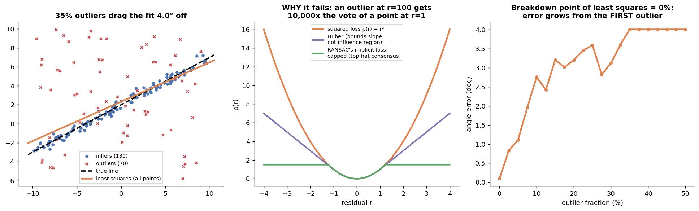
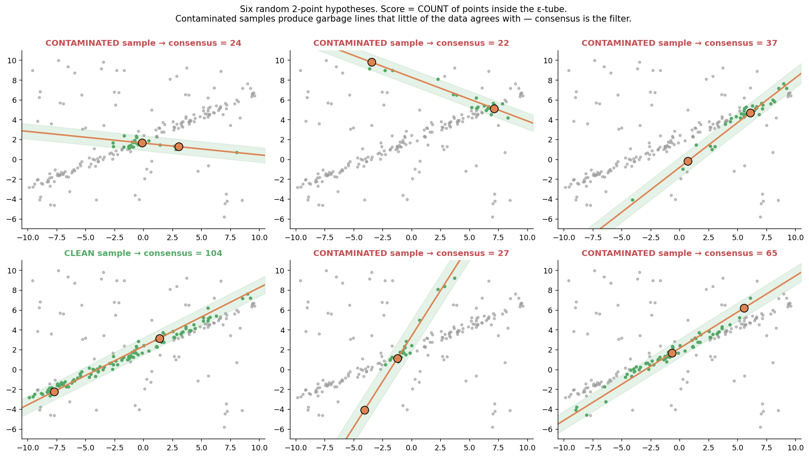
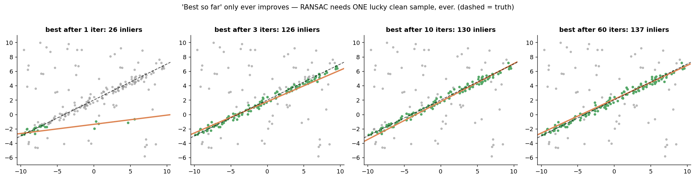
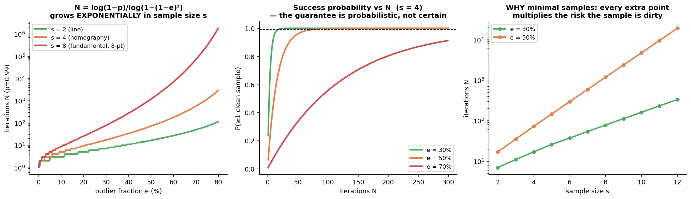
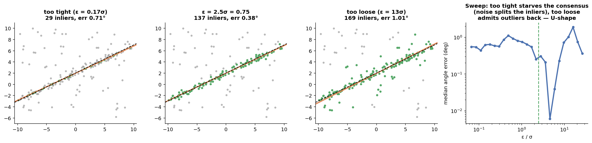
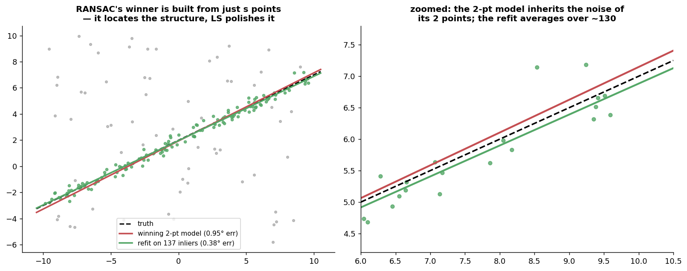
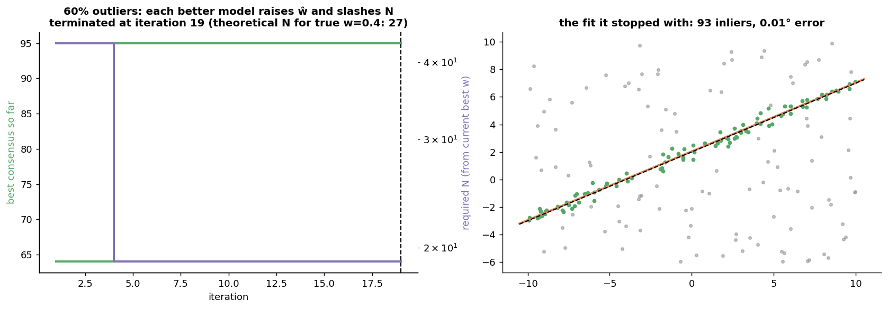
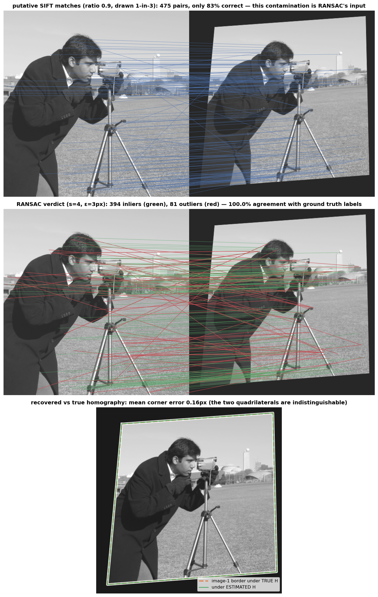
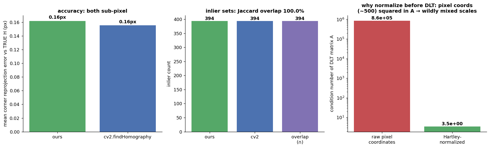
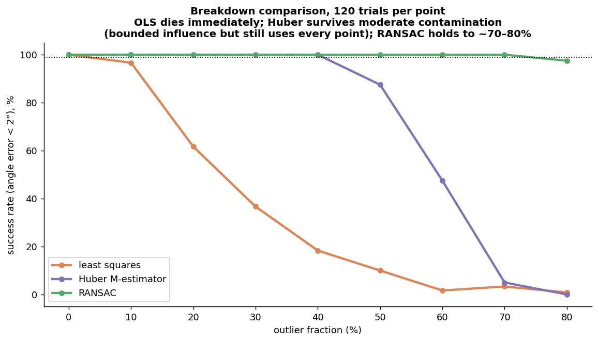

# RANSAC From First Principles

**RANdom SAmple Consensus** (Fischler & Bolles, 1981), built one component at a time. This completes the pipeline from the SIFT doc: SIFT gives you putative correspondences that are ~10–40% wrong, and RANSAC is the machine that extracts the correct geometry from that contaminated set.

RANSAC solves one problem: **fit a model to data when a large fraction of the data has nothing to do with the model.** The design is an *inversion* of classical fitting logic:

```
Classical fitting:  use ALL the data to compute ONE model, hope outliers average out
                    → fails: they don't average out, they dominate (§1)

RANSAC:             use MINIMAL data to hypothesize MANY models,
                    let the rest of the data VOTE on each                    (§2)
        + math for how many hypotheses to draw                              (§3)
        + a threshold defining "agrees with the model"                      (§4)
        + least-squares polish on the winning consensus set                 (§5)
        + adaptive early termination                                        (§6)
```

Everything is implemented from scratch in `ransac_scratch.py` — one generic `ransac()` loop plus problem plumbing for two model types (line: $s{=}2$; homography via normalized DLT: $s{=}4$). Validated on a real homography-from-SIFT-matches task: **our inlier set is identical to `cv2.findHomography`'s (100% Jaccard overlap, 394/394 inliers) and both recover the true homography to 0.16 px mean corner error.** `ransac_walkthrough.py` generates every figure.

---

## 1. The problem: least squares has a breakdown point of 0%

### The math

Least squares minimizes $\sum_i r_i^2$. Its estimate satisfies $\sum_i r_i \frac{\partial r_i}{\partial \theta} = 0$ — each point's pull on the solution (its *influence*) is proportional to its residual $r_i$. So the worst points pull hardest: an outlier at residual 100 gets **10,000×** the vote of an inlier at residual 1. The **breakdown point** — the contamination fraction a method survives — is exactly 0%: one sufficiently bad point moves the estimate arbitrarily far.

### The code

```python
def fit_line_ols(pts):            # total least squares (perpendicular residuals)
    c = pts.mean(0)
    _, _, Vt = np.linalg.svd(pts - c)
    a, b = Vt[-1]                 # normal = direction of least variance
    return np.array([a, b, -(a*c[0] + b*c[1])])
```

### The output



Left: 35% uniform outliers drag the fit ~4° off the true line — subtle-looking on the plot, fatal for downstream geometry. Middle: the loss functions tell the story. Squared loss grows without bound; Huber caps the *slope* (linear tails) which helps, but every point still votes forever; RANSAC's consensus counting is implicitly a **capped** loss — beyond ε your influence is a constant, i.e. zero at the margin. Right: OLS error grows from the very first outlier — the 0% breakdown point, measured.

**Why not just use a robust loss (Huber, Tukey)?** M-estimators are solved iteratively from a starting point — usually the OLS solution. At high contamination the *start* is already captured by the outliers and the iterations polish the wrong answer. §9 measures this: Huber survives to ~50% and then collapses. RANSAC's trick is that it never needs a good global starting point.

---

## 2. The inversion: hypothesize from minimal samples, verify by consensus

### The idea, stated carefully

Two moves, each targeting a specific weakness of classical fitting:

**Move 1 — fit to the *minimal* sample.** A line needs 2 points; fit to exactly 2. Not because 2 points give a good fit (they give a noisy one — §5 fixes that), but because of a probability you'll compute in §3: a sample either contains *only* inliers (→ roughly correct model) or it doesn't (→ garbage model). Small samples are exponentially more likely to be clean, and unlike averaging methods, RANSAC only ever needs **one** clean sample to succeed.

**Move 2 — score by *counting*, not by residual sum.** For each hypothesized model, count the points within ε of it (the *consensus set*). Why counting: a garbage model from a contaminated sample passes near its own 2 points and, by accident, a few others — the structured majority of inliers won't lie near a random line. Counting is also a **bounded-influence score**: each point contributes at most 1, so outliers can't dominate the *scoring* the way they dominated the least-squares objective. (Scoring by total residual would re-import the original disease.)

### The code (this loop IS the algorithm)

```python
while it < N:
    idx = rng.choice(n_data, size=s, replace=False)     # hypothesize...
    model = fit_minimal(idx)
    cnt = (residuals(model) < eps).sum()                # ...verify by counting
    if cnt > best_cnt:
        best_model, best_cnt = model, cnt
        N = n_iterations(p, cnt / n_data, s)            # §6: adapt the bound
```

### The output



Six random 2-point hypotheses on the same data. Five are contaminated: their lines are garbage, and the data says so — consensus 22, 22, 27, 37, 65. The one clean sample scores **104**. The gap between "clean" and "contaminated" scores is the entire mechanism; RANSAC is just a search for a sample on the right side of that gap.



Best-so-far only ever improves, and one lucky draw (here by iteration 10) essentially finishes the job. Everything after is confirmation.

---

## 3. How long to search: the one formula to memorize

### The math

Let $w$ = inlier fraction, $s$ = minimal sample size. Assuming independent draws:

$$P(\text{one sample all-inlier}) = w^s \qquad\Rightarrow\qquad P(\text{all } N \text{ samples dirty}) = (1 - w^s)^N$$

Demand failure probability at most $1-p$ (typically $p = 0.99$):

$$\boxed{\;N = \frac{\log(1 - p)}{\log(1 - w^s)}\;}$$

### The output



Three lessons packed in one figure:

- **Left — $N$ explodes exponentially in $s$.** At 50% outliers with $p=0.99$: a line ($s{=}2$) needs 17 iterations, a homography ($s{=}4$) needs 72, the 8-point fundamental matrix needs **1177**. This is *why* minimal samples are non-negotiable (right panel: adding points to the sample only multiplies the chance it's dirty), and why practitioners fight for smaller solvers — the 7-point fundamental and 5-point essential algorithms exist purely to shrink $s$ in this formula.
- **Middle — the guarantee is probabilistic.** $p = 0.99$ means 1-in-100 runs finds no clean sample and returns junk. Downstream code must treat RANSAC output as *probably* right (sanity-check inlier counts!), not certainly right.
- Note what $N$ does **not** depend on: the number of data points. Only the contamination *ratio* and the sample size matter. More matches at the same precision cost nothing extra in iterations.

---

## 4. The threshold ε: the only genuinely hard parameter

### The math

ε defines "agrees with the model." If inlier noise is Gaussian with std σ, the perpendicular residual of a true inlier is $\sim \mathcal{N}(0, \sigma)$, so

$$\varepsilon = 2.5\,\sigma \;\;(\text{captures } 98.8\%)\qquad\text{or generally } \varepsilon = k\sigma$$

For 2-D residuals (reprojection error of a homography), $r^2 \sim \sigma^2 \chi^2_2$, giving $\varepsilon = \sqrt{5.99}\,\sigma \approx 2.45\sigma$ for 95%. In practice for image matching, σ ≈ 1 px of localization noise → the ubiquitous ε = 3 px default (which is also `cv2`'s).

### The output



The failure modes are asymmetric and worth internalizing:

- **Too tight (left):** even a *correct* model captures only the sliver of inliers whose noise happens to be tiny — consensus can't distinguish good models from lucky garbage, and the "winning" model chases noise. The inlier population gets split by its own noise.
- **Too loose (3rd panel):** outliers rejoin the consensus set; scores of wrong models inflate; and worse, the §5 refit ingests outliers — you've re-created the original problem inside the refit.
- The sweep (right) shows a wide flat basin around 2–4σ: the *order of magnitude* matters, the exact value doesn't. This is why the noise scale σ — not ε itself — is the real thing you need to know about your data. (Not knowing σ is exactly the problem MAGSAC solves; §10.)

---

## 5. Refit: RANSAC locates, least squares polishes

The winning model was built from just $s$ points and inherits their noise in full. But its consensus set is (nearly) outlier-free — which is precisely the condition under which least squares is *optimal* again. So: refit on the consensus set, re-gate inliers with ε, repeat a couple of times.

```python
for _ in range(3):                     # "LO-lite": refit -> re-gate -> repeat
    model = fit_line_ols(pts[mask])
    mask  = line_residuals(model, pts) < eps
```



The division of labor is the insight: **RANSAC is a search procedure, not an estimator.** Its job is to *find the inlier population*; the estimator (LS on that population) then does what it was always good at. The zoom shows the 2-point model wobbling with its 2 points' noise while the refit averages over ~130. (Doing this refit *inside* the loop whenever a new best is found is LO-RANSAC — it converges in fewer iterations because polished models recruit larger consensus sets, which tightens the §6 bound faster.)

---

## 6. Adaptive termination: you don't know w — estimate it as you go

The §3 formula needs the inlier ratio $w$, which is unknown in advance. The fix is a bootstrap: start with $N = \infty$ (pessimism), and whenever a new best model appears, use *its* inlier ratio as the estimate $\hat{w} = \text{cnt}/n$ and recompute $N$. The bound only ever shrinks; the loop exits when the iteration counter crosses it.



At 60% outliers: each jump in best-consensus (green steps) slashes the required $N$ (purple, log scale) — from thousands down to the theoretical ~26 for the true $w = 0.4$ within a handful of lucky draws. The trace makes the economics visible: **you pay for your worst early estimate only until your first decent model.**

---

## 7. The real task: homography from contaminated SIFT matches

Now the pipeline this doc exists for. Warp `camera` with a known projective transform $H_{gt}$ (a genuine perspective warp, not just affine), match SIFT features between original and warped with a *deliberately loose* ratio test (0.9) to admit outliers: **475 putative matches, only 83% correct.**

### The model: homography, and the DLT

A homography maps homogeneous points $\mathbf{x}' \sim H\mathbf{x}$ ($3{\times}3$, 8 DOF — scale is free, hence $s = 4$ correspondences × 2 equations each). The "∼" (equality up to scale) is handled by cross-multiplying: each correspondence $(x,y) \to (u,v)$ yields two linear equations in the 9 entries $\mathbf{h}$:

$$\begin{bmatrix} -x & -y & -1 & 0 & 0 & 0 & ux & uy & u \\ 0 & 0 & 0 & -x & -y & -1 & vx & vy & v \end{bmatrix} \mathbf{h} = \mathbf{0}$$

Stack into $A\mathbf{h} = \mathbf{0}$; the solution is the **smallest right singular vector of $A$** (the unit vector minimizing $\|A\mathbf{h}\|$ — least squares for homogeneous systems).

### Why Hartley normalization is not optional

Look at the $A$ matrix entries: raw pixel coordinates (~500) sit next to 1's next to *products* of coordinates (~250,000) — six orders of magnitude of scale mixing in one matrix. SVD in floating point on that is numerically fragile. The fix: translate each point set's centroid to the origin and scale mean distance to $\sqrt{2}$, run DLT, then undo the transforms: $H = T_2^{-1} \hat{H} T_1$. Measured on our data: **cond(A) drops from 8.6×10⁵ to 3.5** — five orders of magnitude, from two matrix multiplications. (Hartley's 1997 paper "In Defense of the Eight-Point Algorithm" is this observation; it rehabilitated an entire algorithm.)

```python
def dlt_homography(p1, p2):
    p1n, T1 = normalize_pts(p1);  p2n, T2 = normalize_pts(p2)   # centroid->0, mean dist->sqrt(2)
    A = [rows built from p1n, p2n]
    _, _, Vt = np.linalg.svd(A)
    H = Vt[-1].reshape(3, 3)
    return inv(T2) @ H @ T1          # undo normalization
```

One RANSAC-specific addition: a **degeneracy check** — if any 3 of the 4 sampled points are collinear, the homography is not determined; skip the sample rather than fit garbage.

### The output



Top: the contaminated input — 475 matches, the wrong ones plainly visible as lines crossing the flow. Middle: RANSAC's verdict with $s{=}4$, ε = 3 px — 394 inliers (green), 81 outliers (red), **100% agreement with the ground-truth labels**, found in **10 iterations** (the §3 formula for $w{=}0.83$, $s{=}4$: $N = 8$ — measured behavior matches theory). Bottom: the image-1 border mapped through the estimated vs true homography — the quadrilaterals are indistinguishable at **0.16 px** mean corner error.

---

## 8. Validation against OpenCV



`cv2.findHomography(..., cv2.RANSAC, 3.0)` on the same 475 matches: **identical inlier set (Jaccard 100%, 394 = 394)** and the same 0.16 px corner accuracy. Right panel: the conditioning measurement from §7. As with SIFT, the claim isn't bit-equality (different RNG, different internal refinement) — it's that the from-scratch implementation makes the *same decisions* on real data.

---

## 9. The breakdown stress test: the whole story in one plot

Monte Carlo: 120 trials per contamination level, success = fitted line within 2° of truth.



| method | breaks down at | why |
|---|---|---|
| least squares | immediately | unbounded influence (§1) |
| Huber M-estimator | ~50–60% | bounded influence, but still uses every point and needs a viable starting fit |
| RANSAC | ~80%+ | needs only ONE clean minimal sample, ever |

The Huber curve is the subtle lesson: robust losses are genuinely good (flawless to 40% here — use them when contamination is mild!) but they are *repairs* to the all-points paradigm. RANSAC's survival at 70–80% comes from abandoning that paradigm entirely. The practical cost of that survival is §3's formula: at 80% outliers with $s{=}4$, $N \approx 2876$ — RANSAC pays in iterations for what it refuses to pay in bias.

---

## 10. Parameters, variants, and where it sits

| Parameter | Typical | Controls | Failure if wrong |
|---|---|---|---|
| ε | 2–3σ (≈3 px for matching) | inlier definition | §5's U-curve: split inliers / re-admit outliers |
| $p$ | 0.99 | success guarantee | too low → silent junk output |
| $s$ | model-minimal, always | iteration count | $N$ grows exponentially (§3) |
| max_iter | cap on $N$ | worst-case runtime | too low + high contamination → §3's guarantee void |

The variants are each a targeted fix to one weakness of the vanilla loop:

- **MSAC** — replace counting with a truncated quadratic score ($\sum \min(r_i^2, \varepsilon^2)$): among models with equal counts, prefer the one whose inliers fit *better*. Nearly free, strictly better; what cv2 actually uses inside `findHomography`.
- **PROSAC** — matches come with quality scores (the SIFT ratio!); sample from the best-ranked matches first instead of uniformly. Often 10–100× fewer iterations.
- **LO-RANSAC** — §5's refit moved inside the loop.
- **MAGSAC++** — marginalizes over ε instead of fixing it, removing the one hard parameter (§4). Current default recommendation; in OpenCV as `cv2.USAC_MAGSAC`.
- **USAC / GC-RANSAC** — frameworks combining all of the above + degeneracy testing + spatial coherence.

Connections for your work:

- **Auto-GCP selection:** this doc + the SIFT doc is your literal pipeline — detect/describe on satellite image and reference basemap, ratio-test match, RANSAC a transform. Two notes that matter there: for *orthorectified-to-orthorectified* registration, the correct model is often affine or even similarity, not homography — fewer DOF → smaller $s$ → exponentially fewer iterations *and* less risk of overfitting to a degenerate point configuration. And the final inlier count is your GCP-quality gate: a low consensus is the signal to reject the frame, not to trust a 99%-confidence answer built from a 5% inlier ratio.
- **Two-view geometry (MASt3R lineage):** swap the homography for the essential matrix (5-point solver + RANSAC) and this is classical SfM's front end. Learned matchers (LoFTR, MASt3R) produce denser, cleaner matches — but their outputs still go through exactly this consensus machinery (usually MAGSAC) because learned confidence is not geometric consistency.
- The deeper pattern is worth naming: **hypothesize-from-minimal-data + verify-by-consensus** is a general strategy for estimation under gross contamination, not a vision trick. Hough transforms are the dual (every point votes for all models through it); particle filters share the hypothesize-and-score skeleton.

---

## Files

- `ransac_scratch.py` — the generic loop + line and normalized-DLT-homography plumbing.
- `ransac_walkthrough.py` — generates every figure (the Monte Carlo in §9 dominates the ~2 min runtime).
- `figs/*.png` — all intermediate outputs.

Run: `python ransac_walkthrough.py` (needs `numpy`, `matplotlib`, `scipy`, `opencv-python`, `scikit-image`).
