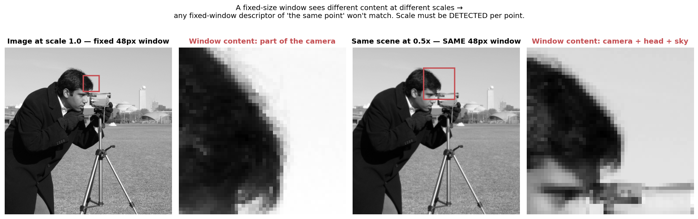
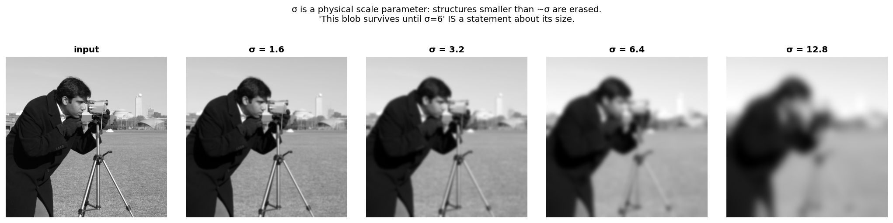
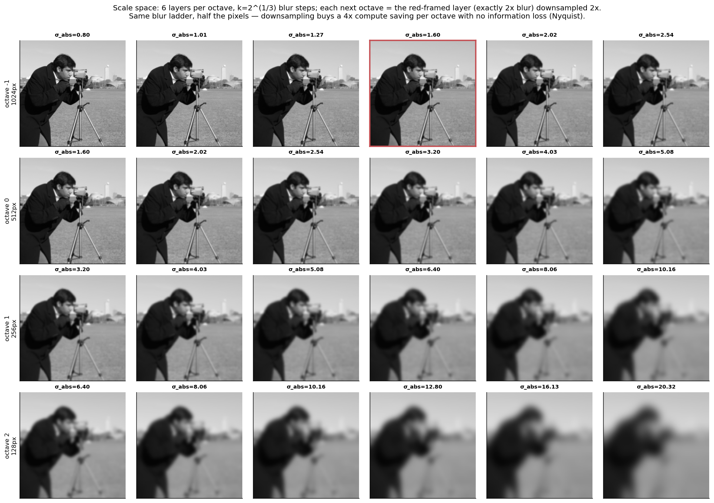
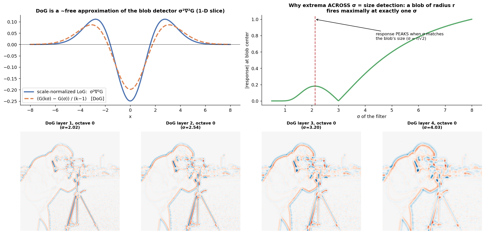
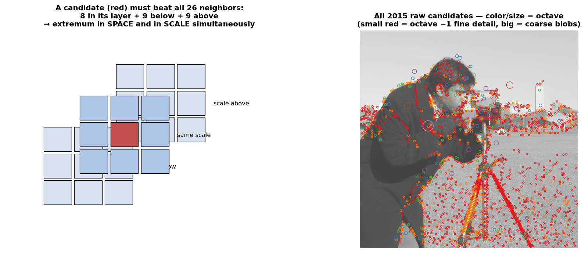
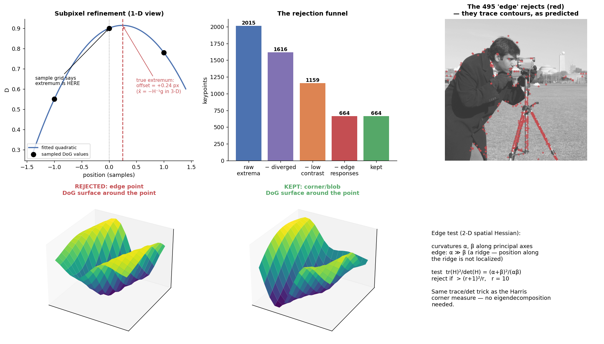
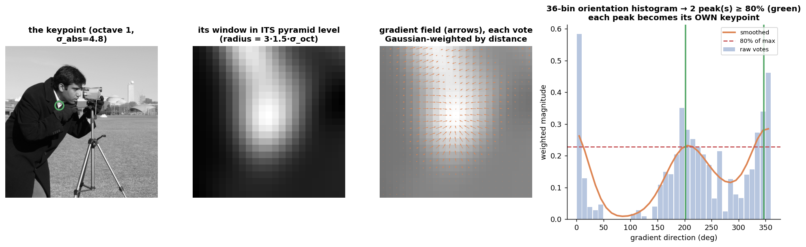
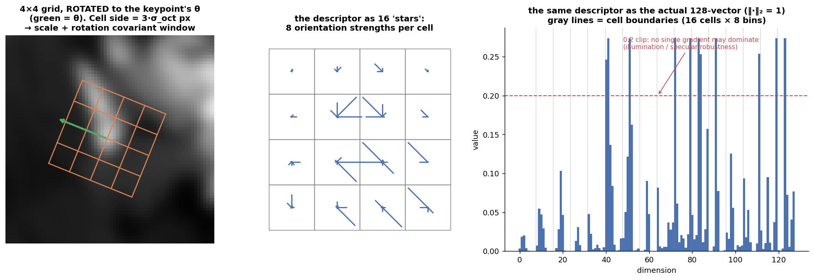
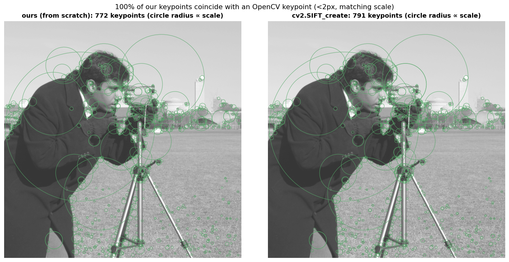
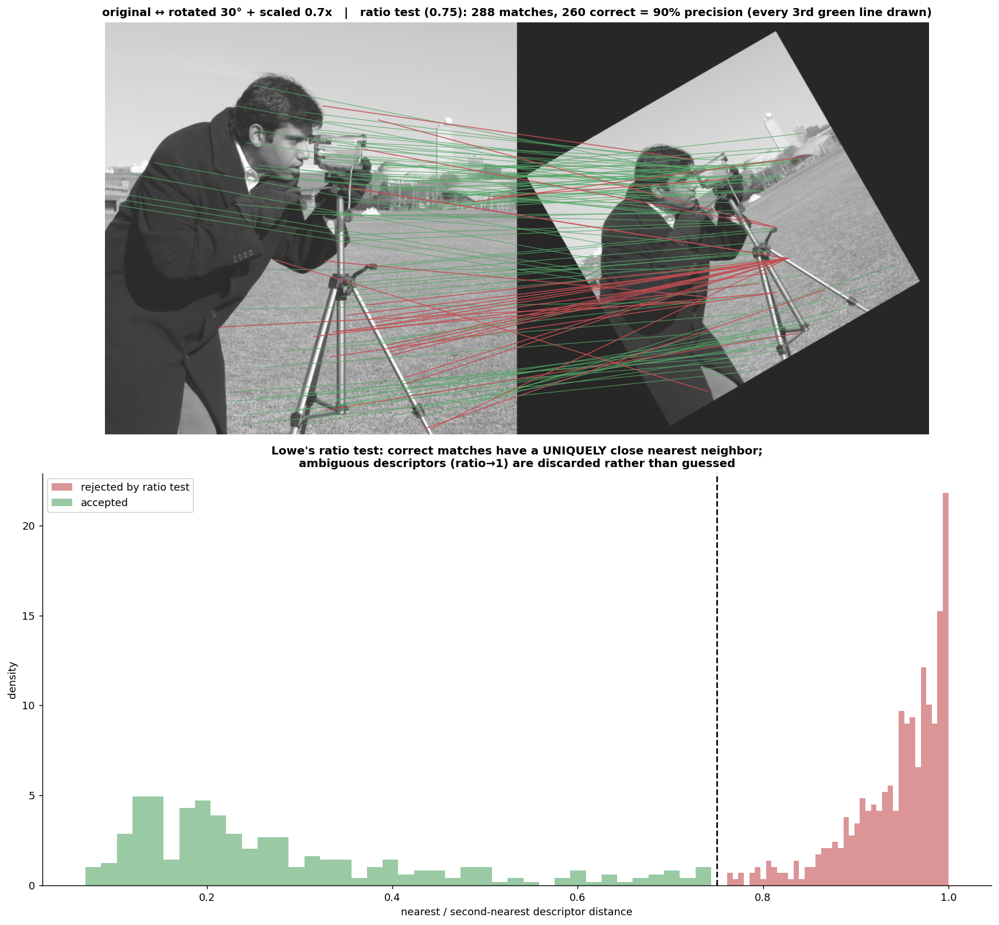

# SIFT From First Principles

**Scale-Invariant Feature Transform** (Lowe, 1999/2004), built one component at a time. Like the CLAHE doc, the structure follows the design logic: each component exists because a specific, demonstrable problem would otherwise break the pipeline.

SIFT answers one question: **how do you describe a point in an image such that the same physical point, seen at a different scale, rotation, and illumination, produces the same description?** The answer decomposes into two halves:

```
DETECTOR  — find points whose location AND scale are recoverable properties of the image itself
   1. Scale space (Gaussian pyramid)      → make "scale" a searchable axis
   2. Difference of Gaussians             → a cheap blob detector across that axis
   3. 26-neighbor extrema                 → candidate (x, y, σ) triples
   4. Refinement                          → subpixel accuracy; kill unstable candidates

DESCRIPTOR — describe each point in ITS OWN coordinate frame so the description is invariant
   5. Orientation assignment              → give each keypoint its own rotation frame
   6. 4×4×8 gradient histogram = 128-d    → the fingerprint
   7. Ratio-test matching                 → the payoff
```

Everything is implemented from scratch in `sift_scratch.py` (numpy; cv2 used only for the Gaussian-blur primitive) and validated two ways: **100% of our keypoints coincide with an OpenCV SIFT keypoint** (within 2px + matching scale, 772 vs 791 keypoints), and our descriptors achieve **90% matching precision with 0.24 px median error** under a 30° rotation + 0.7× scaling. `sift_walkthrough.py` generates every figure.

Test image: `skimage.data.camera()` — 512×512, uint8.

---

## 1. The problem: "scale" is not optional

### The failure that motivates everything

Suppose you describe a point by the 48×48 pixel patch around it. Photograph the same scene from twice the distance and describe "the same point" again:



The two descriptions cover **different physical content** — one sees part of the camera, the other sees the camera, its head, and sky. No descriptor computed in a fixed-size window can match across scale change, no matter how clever, because its *input* differs. Rotation has the same structure: a fixed-orientation window sees rotated content.

The conclusion that drives the whole algorithm: **the measurement frame (window size and orientation) must be derived from the image content at each point** — then when the image scales/rotates, the frame scales/rotates with it, and the content inside the frame stays the same. "Detecting scale" is what the first half of SIFT does; "detecting orientation" starts the second half.

---

## 2. Gaussian blur is the scale dial

### The math

The scale space of an image is the family

$$L(x, y, \sigma) = G(x, y, \sigma) * I(x, y), \qquad G(x,y,\sigma) = \frac{1}{2\pi\sigma^2} e^{-(x^2+y^2)/2\sigma^2}$$

### Why Gaussian, specifically

- **σ is a physical size.** Convolving with $G_\sigma$ erases structure smaller than ~σ pixels. So "at what σ does this structure disappear?" is literally a measurement of its size — blur turns *scale* into a *searchable coordinate*, on equal footing with x and y.
- **Gaussian is the only valid choice** (Koenderink 1984, Lindeberg 1994): it's the unique kernel where increasing σ can only *destroy* structure, never create it — no new extrema or ripples appear as you blur (any other kernel, e.g. a box filter, introduces artifacts that would later be detected as fake "features").
- **The semigroup property makes it cheap:** $G_{\sigma_1} * G_{\sigma_2} = G_{\sqrt{\sigma_1^2+\sigma_2^2}}$ — blurs compose by adding *variances*. This one identity is used three separate times in the code below (incremental blurring, compensating camera blur, seeding octaves).



---

## 3. The scale-space pyramid: octaves × layers

### The design, component by component

We need $L(x,y,\sigma)$ sampled densely enough in σ to *search* it. Three decisions, each with a reason:

**(a) Geometric σ spacing, $k = 2^{1/S}$ with $S=3$.** Scale is multiplicative (an object 2× bigger needs 2× the σ, whether that's 1→2 or 8→16), so σ samples are spaced by a constant *ratio*, not a constant step. $S=3$ intervals per doubling is Lowe's empirical sweet spot — his repeatability-vs-S experiments show more layers find more extrema but *less stable* ones.

**(b) Octaves + downsampling.** Once σ doubles, the image holds no structure finer than 2px, so by Nyquist you can throw away every other pixel *losslessly*. Each octave restarts the same σ ladder at half resolution → 4× less compute per octave; the entire pyramid costs only ~1.33× the base level. This is why layer index $S$ (blur exactly $2\sigma_0$) is the one that gets downsampled to seed the next octave.

**(c) $S+3 = 6$ Gaussian layers per octave.** Differencing (next section) turns 6 Gaussians into 5 DoGs; extrema detection needs a layer above and below, leaving exactly $S=3$ usable DoG layers — precisely covering one doubling of σ with no gap and no waste between octaves. The "+3" is bookkeeping forced by the derivative-and-neighbor structure, not a tunable.

**(d) The −1 octave.** The input is first **2× upsampled** (and its assumed camera blur of 0.5 becomes 1.0). Why: the finest detectable scale is tied to the sampling grid; doubling the grid roughly quadruples the number of stable keypoints. (Our first run without it found 187 keypoints; with it, 664 — most keypoints live at fine scales.)

### The code

```python
def build_scale_space(img, upsample=True):
    if upsample:                                   # the "-1 octave"
        img = cv2.resize(img, None, fx=2, fy=2); assumed = 2 * ASSUMED_BLUR
    # semigroup use #1: lift input from its camera blur up to sigma0
    base = gauss(img, np.sqrt(SIGMA0**2 - assumed**2))
    for o in range(n_octaves):
        octave = [base]
        for i in range(1, S + 3):
            # semigroup use #2: incremental blur sig[i-1] -> sig[i]
            octave.append(gauss(octave[-1], np.sqrt(sig[i]**2 - sig[i-1]**2)))
        # semigroup use #3: layer S has blur exactly 2*sigma0 -> halve it, restart
        base = octave[S][::2, ::2]
```

### The output



Read it row by row: within an octave, blur climbs by $k=2^{1/3}$ per column. Between rows, resolution halves but the *absolute* σ ladder continues seamlessly (check the σ_abs labels — column 0 of each row continues where column 3 of the previous row left off).

---

## 4. DoG: a blob detector you get almost for free

### The math

The theoretically correct multi-scale blob detector is the **scale-normalized Laplacian of Gaussian**, $\sigma^2 \nabla^2 G$ (Lindeberg). The $\sigma^2$ factor matters: derivatives shrink as blur grows, and $\sigma^2$ exactly compensates so responses are *comparable across scales* — without it, fine scales would always win and "extremum across σ" would be meaningless.

SIFT's move: from the heat-diffusion equation $\partial G / \partial \sigma = \sigma \nabla^2 G$, approximate the derivative with a finite difference between two *already computed* pyramid levels:

$$G(k\sigma) - G(\sigma) \;\approx\; (k-1)\,\sigma^2 \nabla^2 G$$

So the plain difference of adjacent Gaussian layers **is** the scale-normalized LoG, up to the constant $(k-1)$ — and a constant factor doesn't move the location of extrema. The expensive, correctly-normalized detector collapses to one subtraction per layer.

### The code

```python
def build_dog(gauss_pyr):
    return [g[1:] - g[:-1] for g in gauss_pyr]     # that's the whole stage
```

### The output



Top-left: the 1-D curves of $\sigma^2\nabla^2 G$ and the scaled DoG overlap almost perfectly — the approximation is visually exact. Top-right is the conceptual core of the detector: **a blob of radius $r$ produces a response that peaks at exactly one σ** ($\sigma \approx r/\sqrt{2}$). Finding where the response peaks *along the σ axis* therefore measures the blob's size. Bottom: the actual DoG layers — zero (white) in flat areas, strong ± responses (red/blue) at blobs and corners whose size matches that layer's σ.

---

## 5. Extrema detection: maxima of |DoG| in (x, y, σ)

### The idea

A keypoint candidate is a point that beats **all 26 neighbors** of its 3×3×3 cube: 8 in its own DoG layer, 9 in the layer below, 9 above. The spatial comparisons say "this is the center of a blob here"; the scale comparisons say "and σ is matched to its size" — remove the scale comparisons and you'd fire on the same blob at many σ's, with no scale attached.

### The code

```python
# stack all 27 shifted views of the 3-layer cube -> (27, h-2, w-2), fully vectorized
views = np.stack([cube[l, 1+dy:h-1+dy, 1+dx:w-1+dx]
                  for l in range(3) for dy in (-1,0,1) for dx in (-1,0,1)])
center = dogs[i, 1:-1, 1:-1]
is_max = (center >= views.max(0)) & (center > 0)
is_min = (center <= views.min(0)) & (center < 0)
mask = (np.abs(center) > 0.5*CONTRAST_TH/S) & (is_max | is_min)   # cheap pre-filter
```

(Minima matter as much as maxima: dark-blob-on-light and light-blob-on-dark are equally good features. The pre-threshold just skips fitting quadratics to numerically-flat noise in the next stage.)

### The output



2015 raw candidates. Note the structure by octave: small red circles (octave −1) carpet fine texture like the grass; large circles sit on coarse structures like the coat and the tripod. **The detector is already assigning a size to everything it finds** — that's the (x, y, σ) triple.

---

## 6. Refinement: subpixel accuracy + two stability tests

The raw grid extrema are contaminated: the true extremum rarely sits exactly on a sample, low-contrast responses are noise, and DoG (being a Laplacian-like operator) responds strongly along *edges* where position isn't actually pinned down. Three fixes, applied in sequence:

### (a) Subpixel/subscale localization — Taylor fit

Expand DoG quadratically around the candidate ($\mathbf{x} = (\sigma, y, x)$ offsets):

$$D(\mathbf{x}) \approx D + \nabla D^\top \mathbf{x} + \tfrac{1}{2}\mathbf{x}^\top H \mathbf{x} \quad\Rightarrow\quad \hat{\mathbf{x}} = -H^{-1} \nabla D$$

Setting the derivative to zero gives the offset $\hat{\mathbf{x}}$ to the true extremum. If any component exceeds 0.5, the extremum actually belongs to a neighboring sample — step there and re-fit (up to 5 times; non-converging candidates are dropped). Both $\nabla D$ and $H$ come from central finite differences on the DoG cube — no extra image processing.

Why bother: keypoints at coarse octaves live on grids of 4–16+ original pixels; without the fit, "keypoint position" would be quantized to that grid. The fit also refines σ the same way (the offset's first component), and our 0.24 px median matching error later is this stage's direct payoff.

### (b) Contrast test

$$D(\hat{\mathbf{x}}) = D + \tfrac{1}{2} \nabla D^\top \hat{\mathbf{x}}, \qquad \text{reject if } |D(\hat{\mathbf{x}})| < 0.04 / S$$

Weak extrema are the ones that flip under noise/illumination — an unstable detection poisons matching worse than no detection.

### (c) Edge test — 2×2 spatial Hessian

On an edge, DoG forms a *ridge*: strongly curved across the edge (big eigenvalue α), flat along it (tiny β) — the point can slide along the edge freely, so its position isn't a repeatable quantity. Instead of eigendecomposing, use the Harris-style trace/determinant trick (tr $= \alpha{+}\beta$, det $= \alpha\beta$):

$$\frac{\text{tr}(H)^2}{\det(H)} = \frac{(\alpha+\beta)^2}{\alpha\beta} \;\; > \;\; \frac{(r+1)^2}{r} \;\Rightarrow\; \text{reject}, \qquad r = 10$$

The ratio is minimal (=4) when α=β (isotropic blob, perfectly localized) and grows monotonically with anisotropy — so one threshold on it caps the curvature ratio at $r$ with two multiplications.

### The output



Top-left: the 1-D picture of the quadratic fit. Top-middle: the funnel — 2015 → 664 (399 diverged, 457 low-contrast, 495 edge). Top-right is the empirical proof of (c): the edge-rejects, plotted back on the image, **trace the contours** — the tripod legs, the coat outline, the horizon. Bottom: the DoG surface around a rejected edge point is a ridge; around a kept keypoint it's a peak — the two Hessian signatures the test separates.

---

## 7. Orientation assignment: giving each keypoint its own frame

### The idea

Scale invariance is now solved: measure everything in windows proportional to the keypoint's σ. Rotation remains. The fix mirrors the scale fix: **derive a reference orientation from the image content itself**, then describe everything *relative to it*. Rotate the image → content-derived orientation rotates with it → relative measurements unchanged.

### The math

In a window of the keypoint's own pyramid level (crucial — gradients at its detected scale, not raw-image scale), accumulate a 36-bin histogram of gradient directions, each pixel voting with weight

$$w = \underbrace{m(x,y)}_{\text{gradient magnitude}} \times \underbrace{e^{-d^2 / 2(1.5\sigma)^2}}_{\text{Gaussian distance falloff}}$$

Magnitude weighting: strong edges are the reliable orientation evidence. Distance weighting: a hard cutoff would make the histogram jump when the window shifts by a pixel; a soft window changes smoothly. The histogram is smoothed (circular [1,4,6,4,1]/16, ×6) and the peak interpolated with the same parabola trick as stage 6 — sub-bin (< 10°/2) accuracy.

**The 80% rule:** every local peak ≥ 80% of the max spawns its *own* keypoint with its own θ. A corner of a square genuinely has two dominant directions; forcing one choice makes it flip between them across images. Duplicating the keypoint costs a little compute and buys stability — Lowe reports these multi-orientation points contribute disproportionately to stable matches. (This is why we have 772 oriented keypoints from 664 positions.)

### The output



Left to right: the keypoint on the image → its window in its own pyramid level → the gradient field doing the voting → the 36-bin histogram with the 80% line and the winning peak(s) in green.

---

## 8. The descriptor: 128 numbers that survive scale, rotation, and lighting

### The construction

Around the keypoint, take a 4×4 grid of subregions, each subregion spanning $3\sigma_{oct}$ pixels, the whole grid **rotated by θ**. In each subregion, build an 8-bin histogram of gradient orientations **measured relative to θ**. Concatenate: $4 \times 4 \times 8 = 128$ dimensions.

Every design choice closes a specific hole:

| Choice | What breaks without it |
|---|---|
| window ∝ σ, in the keypoint's pyramid level | scale invariance (section 1's failure returns) |
| grid rotated by θ; gradient angles taken as $(\phi - \theta)$ | rotation invariance |
| gradients, not raw pixels | brightness shifts ($I + b$): gradients unchanged |
| final L2 normalization | contrast scaling ($cI$): scales all gradients by $c$, normalized away |
| clip at 0.2, renormalize | non-linear lighting (specularities) distorts a few magnitudes wildly but not *directions*; the clip caps any single gradient's influence |
| 4×4 spatial pooling (not 16×16 pixel-exact) | a few px of residual localization error would shred an exact layout; histograms-per-cell tolerate small shifts. This pooling is the direct ancestor of HOG — and the reason early ConvNet papers compared their pooled feature maps to SIFT |
| **trilinear soft-binning** | hard bin assignment means a gradient at a cell/bin boundary jumps bins under 0.5px of noise — each sample instead spreads its vote linearly over its 2×2×2 neighboring (row, col, orientation) bins |

### The code (core of it)

```python
# rotate offsets INTO the keypoint's frame -- this line IS rotation invariance
x_rot = ( cos_t*dx + sin_t*dy) / hist_width
y_rot = (-sin_t*dx + cos_t*dy) / hist_width
rbin = y_rot + D/2 - 0.5;  cbin = x_rot + D/2 - 0.5      # continuous cell coords
obin = ((grad_angle - theta) % (2*np.pi)) / (2*np.pi) * 8 # angle RELATIVE to theta
# trilinear: each sample votes into its 8 surrounding bins with linear weights
for dr in (0,1):
  for dc in (0,1):
    for do in (0,1):
      w = mag_gauss * (fr if dr else 1-fr) * (fc if dc else 1-fc) * (fo if do else 1-fo)
      np.add.at(hist, (r0+dr+1, c0+dc+1, (o0+do) % 8), w)
desc = normalize(clip(normalize(hist.ravel()), 0.2))
```

### The output



Left: the rotated 4×4 grid on the actual image (green arrow = θ). Middle: the classic "star" rendering — each cell's 8 orientation strengths. Right: the same descriptor as the raw 128-vector, with the 0.2 clip line and cell boundaries marked.

---

## 9. Validation against OpenCV



Our detector finds **772** keypoints vs OpenCV's **791** (2.4% apart), and **100% of ours have an OpenCV keypoint within 2 px at a matching scale**. Not bit-exact like the CLAHE doc — OpenCV differs in floating-point blur order, exact tie-breaking in extrema, and descriptor sampling details — but detector-equivalent, which is the meaningful claim for a feature detector (the test that matters is repeatability, not byte equality).

---

## 10. The payoff: matching under a known warp

Rotate the image 30° and scale it 0.7×, run our full pipeline on both, and match descriptors by nearest neighbor with **Lowe's ratio test**: accept a match only if

$$\frac{d(\text{nearest})}{d(\text{second nearest})} < 0.75$$

Why ratio instead of an absolute distance threshold: descriptor distances aren't calibrated — a "good" distance for a textured keypoint is a terrible one for a bland keypoint. But a *correct* match is characterized by having a uniquely close neighbor, while an incorrect one has many neighbors at similar distances (its best match is essentially a random draw from a dense cloud, so the second draw is about as close). The ratio measures exactly that uniqueness, self-calibrated per keypoint.

Since we know the warp matrix $M$, every match is checkable against ground truth:



**288 matches pass the ratio test; 260 are correct (90.3% precision); median reprojection error 0.24 px** — subpixel, courtesy of stage 6. The bottom histogram shows the ratio test doing its job: accepted matches cluster at low ratios (unique nearest neighbor), the rejected mass piles up near 1.0 (ambiguous). In a real pipeline the remaining ~10% outliers die in RANSAC when fitting the homography/essential matrix — ratio test for per-match filtering, geometric consensus for the rest, is the standard two-stage defense.

---

## 11. The parameters, and where SIFT sits today

| Parameter | Value | Controls | Sensitivity |
|---|---|---|---|
| $S$ | 3 | σ sampling density | Lowe's repeatability experiments peak here; more layers → more but less-stable keypoints |
| $\sigma_0$ | 1.6 | base blur | trade-off: smaller keeps finer detail but admits sensor noise |
| contrast th | 0.04 | min $\|D(\hat x)\|$ | ↑ = fewer, stronger keypoints; the knob to turn on noisy imagery |
| edge $r$ | 10 | max curvature ratio | ↑ = admits more elongated structures |
| ratio test | 0.75 | match uniqueness | 0.7–0.8 typical; ↓ = precision over recall |

Where this connects for you:

- **Photogrammetry / orthorectification:** SIFT-style detect→describe→ratio-test→RANSAC is the classical backbone of GCP-free image registration — your auto-GCP problem is exactly this pipeline with one image replaced by a reference basemap. The subpixel refinement stage (6) is what makes tie points geodetically useful.
- **The learned successors keep the skeleton:** SuperPoint replaces stages 1–7 with a CNN but still outputs (keypoints + descriptors); LoFTR/MASt3R drop explicit keypoints but the ratio test's logic (mutual uniqueness of correspondence) survives as mutual-nearest-neighbor checks. Knowing which SIFT stage a learned method replaces tells you which of its failure modes to expect.
- **When classical SIFT still wins:** large scale/rotation changes with modest viewpoint change, no training data for the domain (e.g., unusual sensors), and anywhere you need the geometry of the detection to be interpretable.

---

## Files

- `sift_scratch.py` — the from-scratch implementation, one function per stage.
- `sift_walkthrough.py` — generates every figure above (runs the pipeline twice for the matching demo; ~90 s total).
- `figs/*.png` — all intermediate outputs.

Run: `python sift_walkthrough.py` (needs `numpy`, `matplotlib`, `scipy`, `opencv-python`, `scikit-image`).
