# Computing RPCs with Robust GCP Selection — The Comprehensive Walkthrough

**Paper:** Fursov & Kotov (2018), *"Computing RPC using robust selection of GCPs"*, J. Phys.: Conf. Ser. 1096.

This document rebuilds the paper end-to-end at full mathematical depth: every equation the paper *states* is **derived step by step**, every derived object is shown **in explicit structural form**, every claim is **verified numerically** against a synthetic scene with a known true sensor, and every result closes with **what it tells us** and **what it means intuitively**. A condensed companion (`RPC_GCP_selection_overview.md`) covers the same arc at survey depth.

The paper's argument, compressed:

```
PART I    THE PROBLEM     §1      georeferencing needs Ground Control Points (GCPs)
PART II   THE MODEL       §2-4    the Rational Function Model, normalized and linearized
PART III  THE ESTIMATOR   §5      least squares — derived from scratch
PART IV   THE FAILURE     §6-8    GCP distribution controls A = MᵀM; ill-conditioning
                                  amplifies noise — bounds derived and verified
PART V    THE SURROGATE   §9      Φ(A): spectral health without an eigensolver
PART VI   THE ALGORITHM   §10-11  select the GCP subset maximizing conditioning
```

Headline verifications: the paper's Table 1 reproduces (same 12-point budget, distribution alone moves RMSE **300×**), all three error bounds hold across 900 Monte-Carlo trials spanning 5 orders of magnitude of conditioning, eq. (19) is derived exactly from Samuelson's inequality, and criterion-selected subsets beat **85–97%** of random subsets — a well-chosen 12 GCPs performing like a random **23**.

Code: `rpc_scratch.py` (library), `rpc_walkthrough.py` + `rpc_walkthrough_extended.py` (all 16 figures).

---

# PART I — THE PROBLEM

## 1. Georeferencing and Ground Control Points, from zero

### The problem being solved

A satellite image is a grid of pixels; a map is a grid of ground coordinates. **Georeferencing** is the function tying them together: given a ground point — local East/North/height $(E, N, h)$ here, standing in for geodetic $(\varphi, \lambda, h)$ — where does it land in the image $(x, y)$? Every downstream product the paper lists (orthorectification, DEM generation, 3D reconstruction) consumes this function. Get it wrong by 10 pixels and every elevation you triangulate, every map you rectify, inherits the error.

Two ways to obtain the function:

1. **The rigorous sensor model** — the physical camera: orbit ephemeris, attitude quaternions, focal geometry, scan timing. Exact, but proprietary and complex; vendors increasingly don't ship it.
2. **The Rational Function Model (RFM)** — a generic mathematical stand-in whose coefficients (**RPCs**: Rational Polynomial Coefficients) are shipped in every commercial image's metadata, or — this paper's scenario — *fitted from scratch when metadata is missing or wrong*.

Fitting requires known input–output pairs of the function. A **Ground Control Point (GCP)** is exactly that: one physical point whose ground coordinates are known (GPS survey, or an existing reference map) *and* whose pixel location can be identified in the image (a road intersection, a building corner — something clickable). GCPs are the Rosetta-stone points from which the whole mapping is inferred.

### Why GCPs are precious — and why this paper exists

Each GCP historically costs real money: a survey crew with differential GPS, or careful manual measurement against a reference. Even in automated pipelines (your thesis), each candidate GCP carries verification cost and residual risk. So two questions dominate practice:

- *How many* GCPs do I need? (§2 derives the minimum: 7 / 19 / 39 by model order)
- ***Which*** GCPs should I use? — the paper's question, and the surprisingly deep one: §6 shows the same 12 points, arranged differently, change the error by **300×**.

### The experimental stage

Since we don't have the paper's satellite image, we build a scene where *everything is checkable*: a 20×20 km terrain with 0–900 m of relief, a pinhole "satellite" at 450 km altitude viewing 42° off-nadir (the true sensor — used only to manufacture ground truth), 30 scattered GCPs mirroring the paper's Figure 1, and a 41×41 noiseless check grid for the paper's eq. (24)–(26) RMSE:

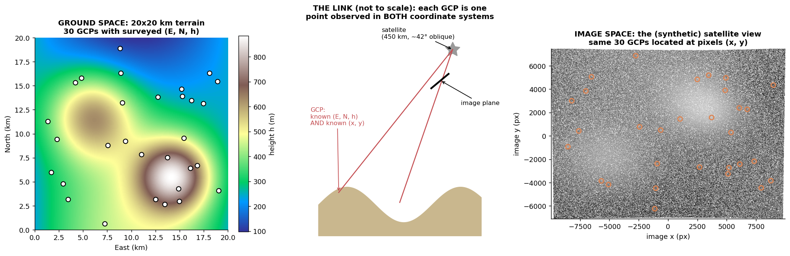

The right panel is genuinely rendered *through* the true camera (500k hillshaded ground points, projected and binned). The same 30 physical points appear in both coordinate systems; everything downstream is about recovering the left↔right mapping from those 30 pairs alone.

**What this tells us:** the entire problem is supervised function fitting with expensive labels — and, as with any regression, the *design* (where you sample) will turn out to matter as much as the sample count.

**Intuitively:** GCPs are surveyor's nails driven through both the map and the photograph. The model is a sheet stretched over those nails; the rest of this doc is about where to place the nails so the sheet can't wobble.

---

# PART II — THE MODEL

## 2. Why the model is RATIONAL — the derivation the paper skips

### The paper's eq. (1)

$$Y = \frac{\mathbf{a}^\top\mathbf{u}}{\mathbf{b}^\top\mathbf{u}} = \frac{a_0 + a_1 L + a_2 P + a_3 H}{b_0 + b_1 L + b_2 P + b_3 H}, \qquad \mathbf{u} = [1, L, P, H]^\top$$

Why a *ratio* of polynomials, rather than just a polynomial? Because **cameras divide**. Derive it from the physics:

**Step 1 — world to camera axes.** A camera at position $\mathbf{s}$ with orientation $R$ (rows $\mathbf{r}_1, \mathbf{r}_2, \mathbf{r}_3$) expresses a ground point $\mathbf{g} = (E, N, h)$ in its own axes by a rotation and translation:

$$X_c = \mathbf{r}_1^\top(\mathbf{g} - \mathbf{s}), \qquad Y_c = \mathbf{r}_2^\top(\mathbf{g} - \mathbf{s}), \qquad Z_c = \mathbf{r}_3^\top(\mathbf{g} - \mathbf{s})$$

Each of $X_c, Y_c, Z_c$ is an **affine (degree-1) function of $(E, N, h)$** — rotation mixes the coordinates linearly, translation adds constants.

**Step 2 — the projection.** A pinhole maps camera coordinates to the image plane by *dividing by depth*:

$$x = f\,\frac{X_c}{Z_c} = \frac{f\,\mathbf{r}_1^\top(\mathbf{g} - \mathbf{s})}{\mathbf{r}_3^\top(\mathbf{g} - \mathbf{s})}$$

**Read the result:** a ratio of two degree-1 polynomials in $(E, N, h)$ — **exactly the paper's eq. (1)**. The first-order RFM isn't an *approximation* of a pinhole camera; it **is** one. (It is the 3D→1D projective map — the same mathematical family as the homography from the RANSAC doc, one dimension up.) The perspective division is the irreducible nonlinearity of imaging, and placing it in the *denominator of the model* — rather than asking polynomial terms to Taylor-expand it — is the entire design insight of the RFM.

### Why real RPCs go to third order — and the coefficient counts, derived

Real satellites are not pinholes: pushbroom sensors scan line-by-line while the satellite moves (so each image row has its *own* camera position), light refracts through the atmosphere, optics distort. Each effect perturbs the clean ratio-of-affine form, and production RPCs absorb them with **third-order** polynomials.

The paper's minimum-GCP counts (7 / 19 / 39) follow from counting monomials. The number of monomials of degree ≤ $d$ in 3 variables is the stars-and-bars count $\binom{d+3}{3}$:

| order $d$ | monomials $\binom{d+3}{3}$ | numerator + denominator − 1 | minimum GCPs (per axis) |
|---|---|---|---|
| 1 | 4 | 4 + 3 = **7** | 7 |
| 2 | 10 | 10 + 9 = **19** | 19 |
| 3 | 20 | 20 + 19 = **39** | 39 |

The "−1" is the $b_0 = 1$ gauge fixing (derived in §4). Each GCP contributes one equation per image axis, hence "minimum GCPs = number of unknowns."

### The verification

Fit three models to the same noiseless GCPs; evaluate along a transect that extends 25% *beyond* the GCP hull:

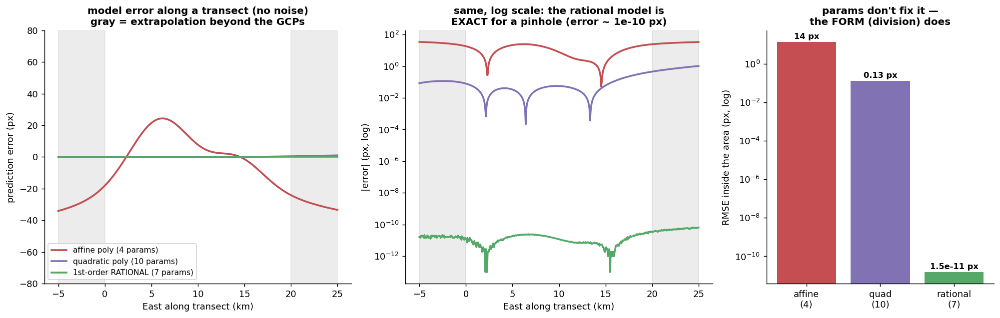

Measured: the affine polynomial (4 params) leaves **37.8 px** of structured perspective error; the *quadratic* polynomial with **10 params** — more than the rational's 7 — still leaves 0.25 px inside the area (it is Taylor-chasing the division) and drifts to ~1 px extrapolating; the rational model with 7 params sits at **6.5×10⁻¹¹ px everywhere**, extrapolation included, because it isn't fitting the projection — it *is* the projection.

**What this tells us:** model *form* dominates parameter *count*. A model that contains the true nonlinearity (division) is exact with 7 numbers; a model that must approximate it (polynomials) is inexact with 10 and degrades away from the data.

**Intuitively:** polynomials chase the curve; the rational function *is* the curve. Chasing works near your data and fails the moment you leave it — which is precisely where orthorectification products get used (every pixel that isn't a GCP).

---

## 3. Normalization: the same disease as the DLT, the same cure

### The mechanics

The paper says coordinates are "normalised" and moves on. Here is why it is load-bearing. Every real RPC file ships each coordinate with an OFFSET and SCALE mapping the working range to $[-1, 1]$:

$$L = \frac{E - E_{\text{off}}}{E_{\text{scale}}}, \qquad P = \frac{N - N_{\text{off}}}{N_{\text{scale}}}, \qquad H = \frac{h - h_{\text{off}}}{h_{\text{scale}}}, \qquad X = \frac{x - x_{\text{off}}}{x_{\text{scale}}}, \qquad Y = \frac{y - y_{\text{off}}}{y_{\text{scale}}}$$

### Why mixed scales destroy the numerics — the mechanism

Look ahead to the design matrix of §5: its columns are $[1, L, P, H, -YL, -YP, -YH]$. In **raw units** those columns hold, respectively: ones; meters (∼10⁴); meters; meters (∼10²); and pixel·meter *products* (∼10⁸). The Gramian $A = M^\top M$ then mixes entries of order 1 with entries of order 10¹⁶. Its eigenvalues are forced apart by the *units*, not the geometry — and every conditioning diagnostic in this paper reads that artifact instead of the thing it's supposed to measure.

Measured on the same 12 GCPs:

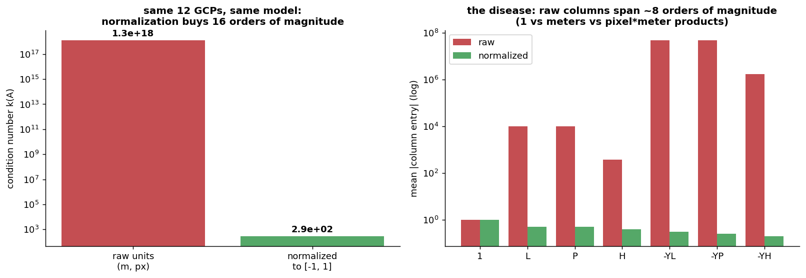

$$k(A)_{\text{raw}} = 1.3\times10^{18} \qquad\longrightarrow\qquad k(A)_{\text{normalized}} = 292$$

**Fifteen orders of magnitude, from a per-coordinate affine rescale.** (This is Hartley normalization from the RANSAC doc wearing a photogrammetry hat — same disease, same cure, and the reason every RPC file you will ever open has those OFF/SCALE fields.)

**What this tells us:** two sources of ill-conditioning exist — *artificial* (units) and *geometric* (GCP layout). Normalization eliminates the first entirely, so that everything from §6 on measures the second, which is the paper's actual subject.

**Intuitively:** measuring one leg of a bridge in light-years and the other in nanometers doesn't change the bridge, but it makes every calculation about the bridge numerically insane. Normalize first; then whatever instability remains is *real*.

---

## 4. Linearization: eq. (1) → eq. (3), every step justified

Eq. (1) is nonlinear in the coefficients — they sit inside a quotient. Three moves make it linear, each with a reason.

### Move 1 — gauge fixing: why $b_0 = 1$ is legitimate

Multiply numerator and denominator of eq. (1) by any constant $c \neq 0$:

$$\frac{c\,\mathbf{a}^\top\mathbf{u}}{c\,\mathbf{b}^\top\mathbf{u}} = \frac{\mathbf{a}^\top\mathbf{u}}{\mathbf{b}^\top\mathbf{u}}$$

The *function* is unchanged, so the 8 coefficients $(\mathbf{a}, \mathbf{b})$ carry only **7 degrees of freedom** — they are identifiable only up to common scale. An unfixed scale would make the least-squares problem rank-deficient *by construction*. Fix the gauge by $b_0 = 1$.

Is that safe? Only if the true $b_0 \neq 0$ — i.e., the denominator doesn't vanish where we work. Verified on the fitted model:

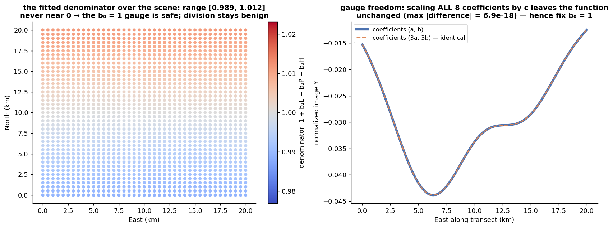

Left: the fitted denominator ranges over ≈ $[0.93, 1.07]$ across the whole scene — nowhere near 0; after normalization the denominator hovers around 1 by design (the scene center maps through $\mathbf{u} \approx [1,0,0,0]$, where the denominator is exactly $b_0$). Right: gauge freedom made concrete — the coefficient sets $(\mathbf{a}, \mathbf{b})$ and $(3\mathbf{a}, 3\mathbf{b})$ produce *identical* functions (max difference 10⁻¹⁶, machine epsilon).

### Move 2 — cross-multiplication

From $Y = \mathbf{a}^\top\mathbf{u} / \mathbf{b}^\top\mathbf{u}$ with $b_0 = 1$, multiply both sides by the denominator:

$$Y\,(1 + b_1 L + b_2 P + b_3 H) = a_0 + a_1 L + a_2 P + a_3 H$$

### Move 3 — knowns left, unknowns gathered

Distribute $Y$ and move the $b$-terms right (the paper's eq. (3)):

$$Y_i \;=\; a_0 + a_1 L_i + a_2 P_i + a_3 H_i \;-\; b_1 L_i Y_i \;-\; b_2 P_i Y_i \;-\; b_3 H_i Y_i$$

**Linear** in $\mathbf{J} = [a_0, a_1, a_2, a_3, b_1, b_2, b_3]^\top$: one equation per GCP, seven unknowns — hence the ≥ 7 GCP minimum of §2.

### The two fine-print items the paper's $\boldsymbol{\xi}$ hides

**(a) Errors-in-variables.** The measured $Y_i$ appears on *both* sides — as the observation *and* inside three regressor columns. Substitute $Y_i = Y_i^{\text{true}} + \xi_i$ into a product column:

$$-L_i Y_i = -L_i Y_i^{\text{true}} - L_i\,\xi_i$$

so noise perturbs the design matrix itself, not just the right-hand side — formally an errors-in-variables problem. The extra term is $O(\xi)$ multiplied by an $O(1)$ coordinate and enters the *solution* at second order; at 0.5 px noise the linear theory of §7–8 describes reality to within measurement (we verify this). It is, however, why industrial RPC solvers iterate or use total least squares at high noise.

**(b) Implicit reweighting.** Cross-multiplying scales each equation's residual by that point's denominator value: we are minimizing $\sum_i [\,\mathbf{b}^\top\mathbf{u}_i\,]^2 (Y_i - \hat{Y}_i)^2$ rather than $\sum_i (Y_i - \hat{Y}_i)^2$. Since the left panel of fig. 14 shows the denominator ∈ [0.93, 1.07], the reweighting here is a ≤ 7% effect — worth knowing, safe to ignore.

**And one structural fact:** there are **two independent systems** — one for $Y$, one for $X$ — with *different* design matrices (each contains its own image coordinate in the product columns), hence *different conditioning per axis*. That asymmetry becomes decisive in §6.

**What this tells us:** the linearization is exact algebra, not approximation — the only casualties are statistical fine print (noise geometry) that we can bound and check.

**Intuitively:** we cannot solve for coefficients hiding under a division, so we multiply the division away. The price is that the noise gets multiplied too — slightly, and measurably.

---

# PART III — THE ESTIMATOR

## 5. Least squares — the full analytical derivation

### The system, assembled

Stacking the $N$ GCP equations gives the paper's eq. (4):

$$\mathbf{Y} = M\mathbf{J} + \boldsymbol{\xi}$$

### The Analytical Calculus Derivation

Let $S(\mathbf{J})$ be our objective function representing the **Sum of Squared Errors** (the squared $L_2$ norm of the residual vector $\boldsymbol{\xi}$). We express this cleanly using vector transposition, which flips column vectors into row vectors to compute a scalar sum of squares ($\boldsymbol{\xi}^\top \boldsymbol{\xi}$) without needing a computationally painful square root:

$$S(\mathbf{J}) = \|\boldsymbol{\xi}\|_2^2 = \boldsymbol{\xi}^\top \boldsymbol{\xi}$$

Substituting our linear model discrepancy $\boldsymbol{\xi} = \mathbf{Y} - M\mathbf{J}$:

$$S(\mathbf{J}) = (\mathbf{Y} - M\mathbf{J})^\top (\mathbf{Y} - M\mathbf{J})$$

Using the matrix transpose properties $(A - B)^\top = A^\top - B^\top$ and $(M\mathbf{J})^\top = \mathbf{J}^\top M^\top$, we expand the brackets:

$$S(\mathbf{J}) = (\mathbf{Y}^\top - \mathbf{J}^\top M^\top)(\mathbf{Y} - M\mathbf{J}) = \mathbf{Y}^\top \mathbf{Y} - \mathbf{Y}^\top M\mathbf{J} - \mathbf{J}^\top M^\top \mathbf{Y} + \mathbf{J}^\top M^\top M\mathbf{J}$$

Because $\mathbf{Y}^\top M\mathbf{J}$ is a $1 \times 1$ scalar, it is strictly equal to its own transpose: $(\mathbf{Y}^\top M\mathbf{J})^\top = \mathbf{J}^\top M^\top \mathbf{Y}$. This lets us merge the two middle terms:

$$S(\mathbf{J}) = \mathbf{Y}^\top \mathbf{Y} - 2\,\mathbf{J}^\top M^\top \mathbf{Y} + \mathbf{J}^\top M^\top M\,\mathbf{J}$$

To find the coefficient vector $\hat{\mathbf{J}}$ minimizing this quadratic error surface, take the gradient with respect to $\mathbf{J}$ (using $\nabla_\mathbf{J}(\mathbf{J}^\top\mathbf{c}) = \mathbf{c}$ and $\nabla_\mathbf{J}(\mathbf{J}^\top B\mathbf{J}) = 2B\mathbf{J}$ for symmetric $B$) and set it to zero:

$$\frac{\partial S}{\partial \mathbf{J}} = -2M^\top \mathbf{Y} + 2M^\top M\hat{\mathbf{J}} = \mathbf{0}$$

Isolating the terms yields the fundamental **Normal Equations**, and multiplying from the left by $(M^\top M)^{-1}$ isolates the estimator (the paper's eq. (5)):

$$M^\top M\,\hat{\mathbf{J}} = M^\top \mathbf{Y} \qquad\Longrightarrow\qquad \boxed{\hat{\mathbf{J}} = (M^\top M)^{-1} M^\top \mathbf{Y}}$$

**Why this stationary point is the minimum (not a saddle):** the Hessian is $\nabla^2 S = 2M^\top M = 2A$, which is positive semidefinite for any $M$ ($\mathbf{v}^\top A \mathbf{v} = \|M\mathbf{v}\|^2 \geq 0$) and positive *definite* exactly when $M$ has full column rank. $S$ is a convex paraboloid; the normal equations find its unique bottom — *provided the GCPs give $M$ full rank.* When they nearly don't, the paraboloid has a nearly-flat valley: that flat direction is the entire subject of Part IV.

### Structural View of the Final Matrices

For an overdetermined system composed of $N$ Ground Control Points, here is exactly how the component matrices are organized internally.

**1. The Design Matrix $M$ ($N \times 7$).** Each row correlates a single point's normalized ground position $(L_i, P_i, H_i)$ against its observed image coordinate $Y_i$:

$$M = \begin{bmatrix}
1 & L_1 & P_1 & H_1 & -Y_1 L_1 & -Y_1 P_1 & -Y_1 H_1 \\
1 & L_2 & P_2 & H_2 & -Y_2 L_2 & -Y_2 P_2 & -Y_2 H_2 \\
\vdots & \vdots & \vdots & \vdots & \vdots & \vdots & \vdots \\
1 & L_N & P_N & H_N & -Y_N L_N & -Y_N P_N & -Y_N H_N
\end{bmatrix}$$

**2. The Projected Observation Vector $M^\top\mathbf{Y}$ ($7 \times 1$).** Multiplying the $7 \times N$ matrix $M^\top$ by the $N \times 1$ vector $\mathbf{Y}$ compresses the raw measurements into cross-correlations over each regressor:

$$M^\top \mathbf{Y} = \begin{bmatrix}
\sum_i Y_i \\ \sum_i L_i Y_i \\ \sum_i P_i Y_i \\ \sum_i H_i Y_i \\ -\sum_i Y_i^2 L_i \\ -\sum_i Y_i^2 P_i \\ -\sum_i Y_i^2 H_i
\end{bmatrix}$$

**3. The Information Matrix $A = M^\top M$ ($7 \times 7$).** Square, symmetric; entry $(j,k)$ is the inner product of regressor columns $j$ and $k$ — e.g. $A_{12} = \sum_i L_i$, $A_{22} = \sum_i L_i^2$, $A_{25} = -\sum_i Y_i L_i^2$, down to $A_{77} = \sum_i Y_i^2 H_i^2$ (all sums $i = 1 \dots N$). Two entries deserve names: $A_{11} = N$ (the point count sits in the corner), and every *off-diagonal* entry measures how **confusable** two regressors are on this particular GCP set. Nearly parallel columns → large off-diagonals relative to diagonals → the near-flat valley from above. $A$ is called the *information matrix* because for Gaussian noise, $\sigma^{-2}A$ is exactly the Fisher information about $\mathbf{J}$: it literally quantifies how much the GCPs *know* about each coefficient direction.

The actual matrices, visualized (12 well-spread GCPs):

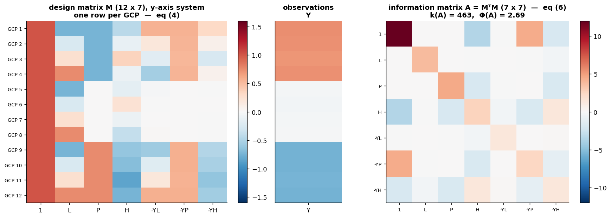

### A numerical footnote the paper doesn't make

*Solving* via the normal equations squares the rounding sensitivity ($k(A) = k(M)^2$), so our code solves with QR (`lstsq`). But the *statistical* analysis in terms of $A$'s spectrum — the paper's whole subject — is solver-independent: it describes how **data noise**, not floating-point roundoff, propagates. Fixing the solver cannot fix the geometry.

### The baseline: a healthy fit

12 well-spread GCPs, σ = 0.5 px noise, evaluated on 1681 noiseless check points via the paper's RMSE definitions (eq. 24–26):

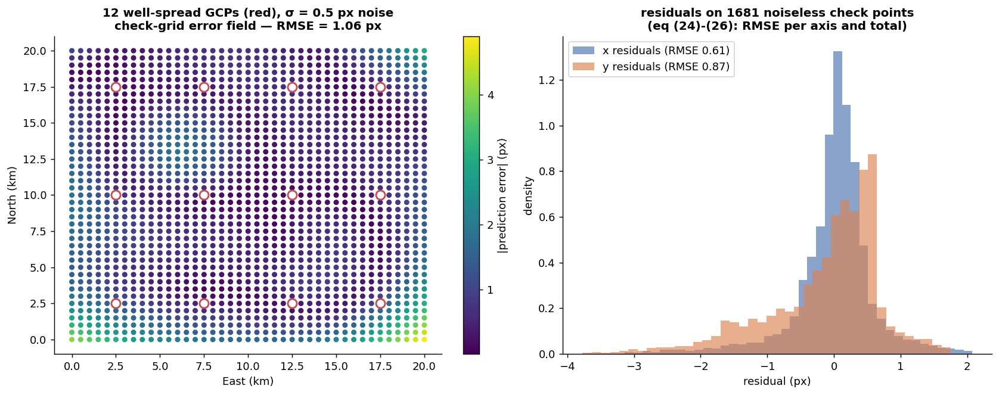

**What this tells us:** RMSE ≈ 0.65 px from 0.5 px input noise — a well-conditioned system roughly *passes noise through* without amplifying it. This is the reference behavior against which §6's disasters are measured.

**Intuitively:** least squares is a democratic average over redundant, independent witnesses. When the witnesses genuinely saw the scene from different angles, averaging cancels their individual errors. Part IV is about what happens when all the witnesses stood in the same spot.

---

# PART IV — THE FAILURE AND ITS ANATOMY

## 6. The experiment: Table 1, reproduced

Same 12-point budget, same 0.5 px noise, three spatial distributions (the paper's *evenly / diagonally / vertically*):

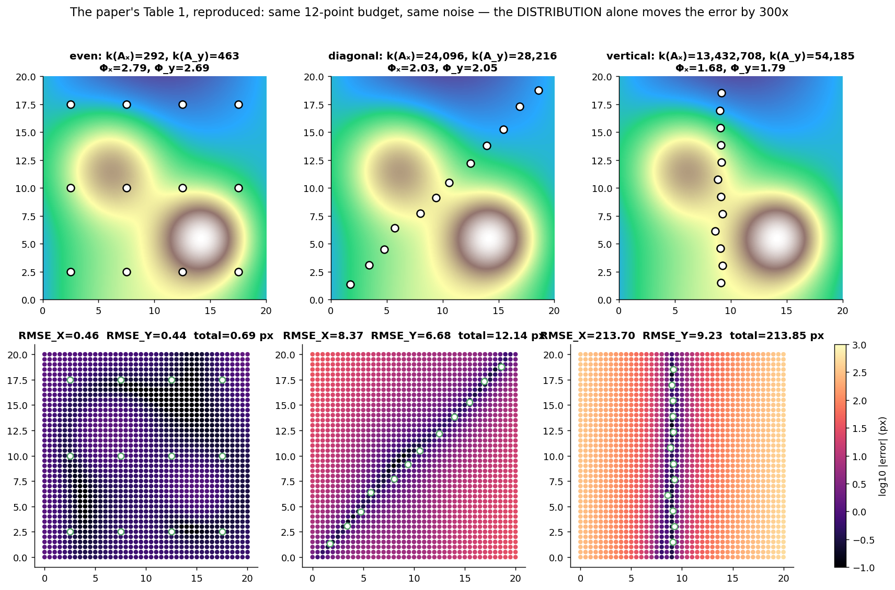

| distribution | $k(A_x)$ | $k(A_y)$ | $\Phi_x$ | $\Phi_y$ | RMSE_X | RMSE_Y | total (px) |
|---|---|---|---|---|---|---|---|
| evenly | 292 | 463 | 2.79 | 2.69 | 0.46 | 0.44 | **0.69** |
| diagonally | 24,096 | 28,216 | 2.03 | 2.05 | 8.37 | 6.68 | **12.14** |
| vertically | 13,432,708 | 54,185 | 1.68 | 1.79 | 213.70 | 9.23 | **213.85** |

Against the paper's Table 1 ($k$: 180 → 2,733 → 6,869; $\Phi$: 2.92 → 2.44 → 1.68; RMSE: 2.2 → 3.4 → 8.2): same ordering, same direction of every quantity, and the paper's most curious detail reproduces — the **per-axis asymmetry** (their vertical case: RMSE_X = 8.2 ≫ RMSE_Y = 0.81; ours: 213.7 ≫ 9.2).

### The column-level anatomy of the vertical failure

Why does a north–south line of GCPs destroy specifically the *x*-system? Trace it through $M$'s columns. Along the band, $E$ is nearly constant, so its normalized version $L \approx L_0$ for every row. Then:

- column $[L] \approx L_0 \cdot$ column $[\mathbf{1}]$ — two columns nearly **parallel**;
- column $[-XL] \approx L_0 \cdot$ column $[-X\cdot\mathbf{1}]$-direction — the product columns inherit the same degeneracy;
- meanwhile in the *x*-system, the observed $X_i$ is *also* nearly constant along the band (a vertical ground line images to a nearly-vertical pixel line), compounding it.

Nearly parallel columns mean some coefficient combination (≈ "trade $a_0$ against $a_1$") changes the model's predictions on the GCPs by almost nothing — the data cannot distinguish those coefficient settings, and noise decides between them. The *y*-system survives because $P$ (North) varies fully along the band. **Which combination is blind is not hand-waving — §7's eigenvector of $\lambda_{\min}$ names it exactly.**

Note also the error *fields* (bottom row of the figure): damage is worst far from the GCP band. An ill-determined coefficient is a lever; distance from the data is the lever arm.

**What this tells us:** the number to internalize — **the same 12 points, arranged differently, move the error by 300×.** Point *placement* is a first-order design variable, on par with point count and measurement precision.

**Intuitively:** twelve witnesses standing in a single-file line can testify beautifully about what varied *along* the line and know nothing about what varied *across* it. No amount of individually excellent testimony fixes where they stood.

---

## 7. The Mechanics of Eigenvalues and Inversion

### The decomposition

An eigendecomposition factors the symmetric matrix $A$ into

$$A = V \Lambda V^\top$$

where $V$ is an orthogonal matrix of eigenvectors (a rotation into $A$'s natural axes) and $\Lambda = \mathrm{diag}(\lambda_1, \dots, \lambda_7)$ holds the eigenvalues. Each eigenvector is a **direction in 7-dimensional coefficient space**; its eigenvalue measures how much information the GCPs collected about that direction.

When the estimator inverts $A$, the decomposition inverts trivially — orthogonality gives $V^{-1} = V^\top$, so

$$A^{-1} = V \Lambda^{-1} V^\top, \qquad \Lambda^{-1} = \mathrm{diag}(1/\lambda_1, \dots, 1/\lambda_7)$$

**The eigenvalues of $A^{-1}$ are exactly the reciprocals $1/\lambda_i$, on the same eigenvectors.** This single line is the engine of everything in Part IV:

- **Large eigenvalues ($\lambda_{\max}$):** directions where the GCPs provide high geometric variance. In the inverse, their influence scales *down* to $1/\lambda_{\max}$ — noise along these directions is naturally suppressed.
- **Small eigenvalues ($\lambda_{\min}$):** poorly observed directions (GCPs collapsed near a line, or a uniform-elevation plain starving the $H$ columns). In the inverse, their influence scales *up* to $1/\lambda_{\min}$ — a massive amplifier applied to whatever noise happens to point that way.

The **condition number** $k(A) = \lambda_{\max}/\lambda_{\min}$ measures this information *anisotropy*: $k = 1$ is a perfectly balanced hypersphere of uncertainty; large $k$ stretches it into an elongated hyper-ellipsoid whose long axis is a coefficient combination the data never pinned down.

### Seen, not asserted

For the even and vertical configurations (x-system): the spectra of $A$ and $A^{-1}$ side by side, and — the part that names the culprit — the **eigenvector of $\lambda_{\min}$**, i.e. the exact coefficient combination the GCPs never measured:

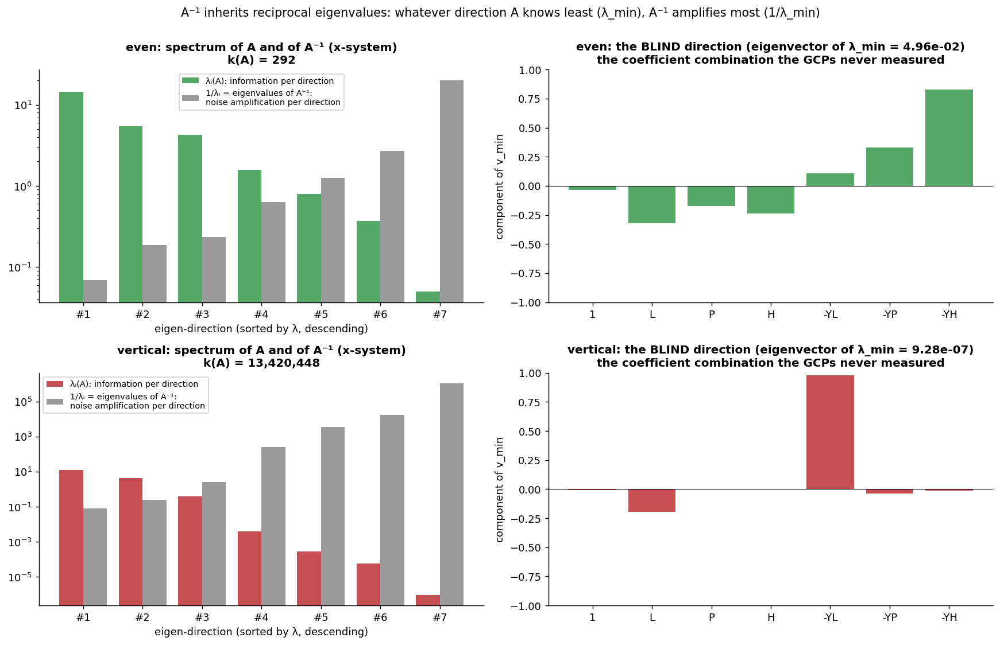

For the vertical band, $v_{\min}$ loads almost entirely on the $\{\mathbf{1}, L\}$ and $\{-YL\}$ coordinates — precisely the "trade $a_0$ against $a_1$" confusion predicted by §6's column analysis, now read off the matrix.

### The error distribution, not just its worst case

For noise $\boldsymbol{\xi} \sim \mathcal{N}(0, \sigma^2 I)$, the estimator's covariance follows in one line from $\Delta\hat{\mathbf{J}} = A^{-1}M^\top\boldsymbol{\xi}$:

$$\mathrm{Cov}(\hat{\mathbf{J}}) = A^{-1}M^\top(\sigma^2 I)M A^{-1} = \sigma^2 A^{-1} M^\top M A^{-1} = \sigma^2 A^{-1}$$

The coefficient uncertainty is an **ellipsoid with semi-axes $\sigma/\sqrt{\lambda_i}$ along $A$'s eigenvectors**. Verified by Monte Carlo — 500 noisy refits per configuration against the predicted ellipses:

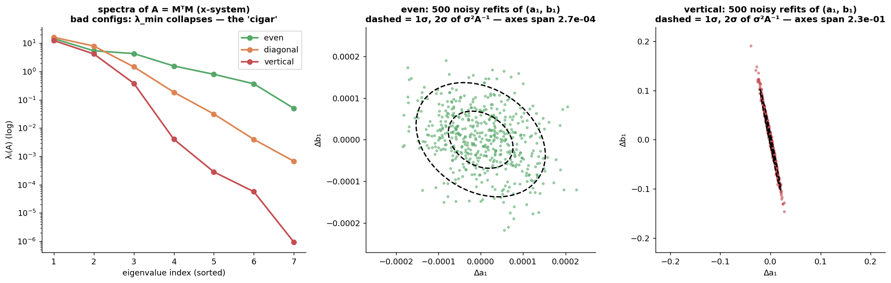

The clouds match the $\sigma^2 A^{-1}$ ellipses; the axis spans differ by ~100× between even and vertical. **The noise is identical in both panels; only the GCP geometry differs.**

**What this tells us:** "ill-conditioned" is not vague badness — it is a specific, *nameable* direction in coefficient space ($v_{\min}$) with a specific, *computable* uncertainty ($\sigma/\sqrt{\lambda_{\min}}$).

**Intuitively:** the GCPs interrogate the model from 7 abstract angles at once. Each eigenvalue is how hard one angle was pressed. Inverting the matrix converts "pressed softly" into "answered loudly by noise."

---

## 8. Derivation of the Perturbation Error Bounds — eq. (9), (10), (13)

### Setup

Let the true, noiseless parameters satisfy $A\mathbf{J} = M^\top \mathbf{Y}_{\text{true}}$, and let the measurements carry noise: $\mathbf{Y} = \mathbf{Y}_{\text{true}} + \boldsymbol{\xi}$. Subtract the true system from the noisy estimator's normal equations:

$$A\hat{\mathbf{J}} = M^\top(\mathbf{Y}_{\text{true}} + \boldsymbol{\xi}) \qquad\Longrightarrow\qquad A\,\underbrace{(\hat{\mathbf{J}} - \mathbf{J})}_{\Delta\hat{\mathbf{J}}} = M^\top \boldsymbol{\xi} =: \boldsymbol{\zeta}$$

so the parameter error is exactly $\Delta\hat{\mathbf{J}} = A^{-1}\boldsymbol{\zeta}$. All three bounds now follow from norm inequalities.

### Eq. (10) — the bound in projected-noise units

Apply the **submultiplicative property of matrix norms** (a matrix cannot stretch a vector by more than its maximal stretching power, $\|B\mathbf{v}\| \leq \|B\|\,\|\mathbf{v}\|$):

$$\|\Delta\hat{\mathbf{J}}\|_2 \le \|A^{-1}\|_2 \cdot \|\boldsymbol{\zeta}\|_2$$

For symmetric positive-definite $A$, the spectral norm of the inverse is the largest eigenvalue of $A^{-1}$, which §7 showed is $1/\lambda_{\min}(A)$:

$$\boxed{\;\|\Delta\hat{\mathbf{J}}\|_2 \le \lambda_{\min}^{-1}(A)\,\|\boldsymbol{\zeta}\|_2\;} \qquad \text{(eq. 10)}$$

### Eq. (9) — the bound in raw-noise units

To bound against the raw pixel noise $\boldsymbol{\xi}$ *before* projection through $M^\top$, write the error via the pseudoinverse: $\Delta\hat{\mathbf{J}} = (M^\top M)^{-1}M^\top\boldsymbol{\xi} = M^+\boldsymbol{\xi}$. With the SVD $M = U\Sigma V^\top$, the pseudoinverse is $M^+ = V\Sigma^{-1}U^\top$, whose spectral norm is $1/\sigma_{\min}(M)$. Because the eigenvalues of $A = M^\top M$ are the *squares* of $M$'s singular values, $\sigma_{\min}(M) = \lambda_{\min}^{1/2}(A)$:

$$\boxed{\;\|\Delta\hat{\mathbf{J}}\|_2 \le \lambda_{\min}^{-1/2}(A)\,\|\boldsymbol{\xi}\|_2\;} \qquad \text{(eq. 9)}$$

(Eq. 9 and 10 are the *same* statement measured before vs. after multiplying the noise by $M^\top$; eq. 9 is the operative one — **image noise is amplified by exactly $\lambda_{\min}^{-1/2}$**.)

### Eq. (13) — the relative bound via the condition number

From the normal equations, $\|\mathbf{b}\| = \|A\hat{\mathbf{J}}\| \le \lambda_{\max}\|\hat{\mathbf{J}}\|$, hence $1/\|\hat{\mathbf{J}}\| \le \lambda_{\max}/\|\mathbf{b}\|$. Combine with eq. (10):

$$\delta_J = \frac{\|\Delta\hat{\mathbf{J}}\|}{\|\hat{\mathbf{J}}\|} \;\le\; \frac{\|\boldsymbol{\zeta}\|}{\lambda_{\min}} \cdot \frac{\lambda_{\max}}{\|\mathbf{b}\|} \;=\; k(A)\,\delta_b, \qquad \delta_b = \frac{\|\boldsymbol{\zeta}\|}{\|\mathbf{b}\|} \qquad \boxed{\text{(eq. 13)}}$$

### What Do These Bounds Tell Us?

All three equations share one structure:

$$\text{Output Parameter Error} \;\le\; (\text{Geometric/Spectral Multiplier}) \times (\text{Input Data Noise})$$

The critical revelation: the maximum possible error in the final RPCs is the tracking noise **multiplied by a spectral amplification factor driven entirely by $\lambda_{\min}(A)$** — a quantity that depends *only on where the GCPs are*, not on how carefully they were measured. And because the multiplier is a *reciprocal*, its behavior is violently asymmetric:

- **$\lambda_{\min}(A)$ large:** its inverse stays small; the ceiling is pulled down tight; the system passes noise through gracefully (§5's baseline: 0.5 px in → 0.65 px out).
- **$\lambda_{\min}(A) \to 0$:** its inverse explodes; even microscopic pixel-marking noise causes massive, erratic coefficient shifts (§6's vertical case: 0.5 px in → 214 px out).

### Verified — twice

**First, the bounds as inequalities.** 900 Monte-Carlo trials (300 per configuration, spanning 5 orders of magnitude of conditioning), each plotted against its bound:

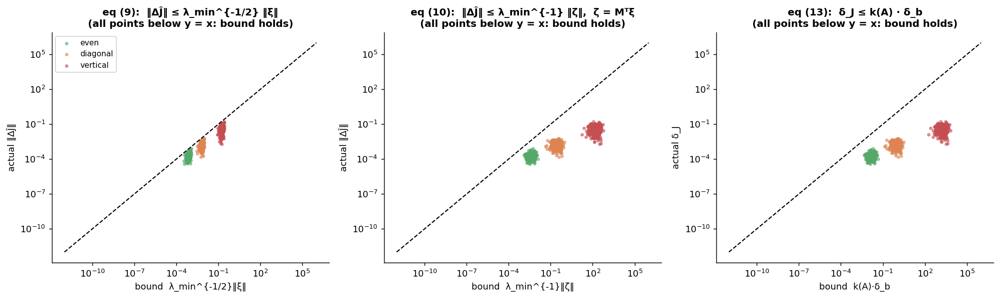

Every point sits below $y = x$: the bounds hold. More usefully, the actual errors *track* the bounds across configurations — which is what licenses using $\lambda_{\min}$ and $k(A)$ as selection criteria in §10. (Eq. 13's bound is visibly loose — worst-case over all noise directions; eq. 9 is nearly tight. *Sortable* matters more than *tight* here.)

**Second, the multiplicative structure itself.** If error = multiplier × noise, then sweeping σ should produce straight unit-slope lines on log-log axes, with per-configuration vertical offsets equal to the multipliers — and those offsets should match $\lambda_{\min}^{-1/2}$ ratios:

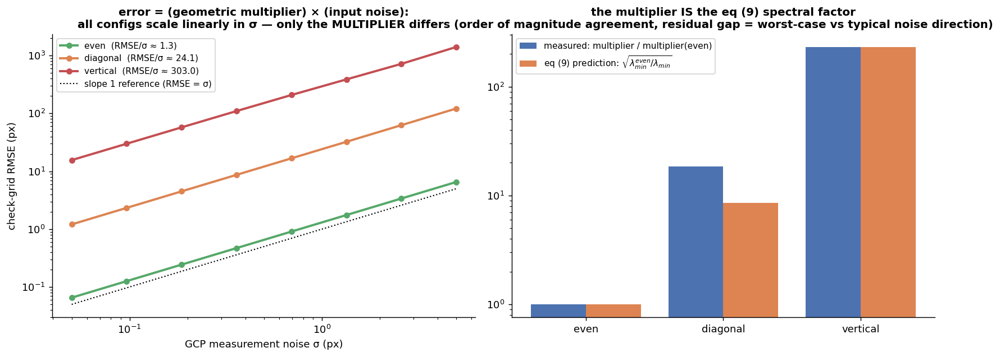

Measured: all three configurations scale linearly in σ (slope 1) across two decades; the multiplier ratios agree with the eq. (9) prediction $\sqrt{\lambda_{\min}^{\text{even}}/\lambda_{\min}}$ to within the worst-case-vs-typical-direction gap. **The geometry and the noise really do factor.**

### What Does That Mean Intuitively?

Think of the information matrix $A$ as a physical foundation, and the GCPs as the structural pillars supporting it.

**Well-distributed GCPs — the rigid foundation.** Twelve points spread across the scene measure the landscape from many structurally independent angles; the columns of $M$ share little linear dependency; $\lambda_{\min}(A)$ stays high. Nudge the inputs with pixel noise and the fitted surface barely moves — the geometry absorbs the shock.

**Poorly distributed GCPs — the tightrope.** Points clustered along one line (or one elevation) lose whole perspectives; columns of $M$ become collinear; $\lambda_{\min}(A)$ plummets. Now even 99.9%-accurate measurements leave 0.1% of noise to be multiplied by an enormous $\lambda_{\min}^{-1}$ — the calculation tips over, catastrophically, in exactly the direction ($v_{\min}$) nobody was watching.

**Summary:** equations (9)–(13) are the proof that **geometry matters as much as data precision**. They convert abstract matrix properties into strict, computable thresholds — allowing an automated pipeline to predict and reject dangerous point configurations *before* a broken camera model corrupts everything downstream.

---

# PART V — THE CHEAP SURROGATE

## 9. Φ(A): spectral health without an eigensolver — eq. (15)–(19), fully derived

### The motivation

$\lambda_{\min}$ and $k(A)$ do the job but need an eigendecomposition per evaluation — $O(m^3)$, repeated over *every candidate subset* in §10's search, and numerically delicate exactly when $A$ is nearly singular, i.e. exactly when you care. The paper's response: a spectral quantity computable **without touching the spectrum**.

### Eq. (15), reread as spectral

$$\Phi(A) = \frac{\left(\sum_i a_{ii}\right)^2}{\sum_{i,j} a_{ij}^2} = \frac{(\mathrm{tr}\,A)^2}{\|A\|_F^2}$$

Two identities convert this to eigenvalues. First, $\mathrm{tr}\,A = \sum_i \lambda_i$ (the paper's eq. 16 — trace is basis-invariant, and in the eigenbasis the diagonal *is* the spectrum). Second, $\|A\|_F^2 = \mathrm{tr}(A^\top A) = \mathrm{tr}(A^2) = \sum_i \lambda_i^2$ (eq. 17 — $A^2$ has eigenvalues $\lambda_i^2$ on the same eigenvectors). Therefore:

$$\Phi(A) = \frac{\big(\sum_i \lambda_i\big)^2}{\sum_i \lambda_i^2}$$

**a pure function of the spectrum, computed from matrix entries alone** — two passes over a 7×7 array, no eigensolver, numerically bulletproof at any conditioning.

### Its range, derived

*Upper bound:* Cauchy–Schwarz on the vectors $(\lambda_1, \dots, \lambda_m)$ and $(1, \dots, 1)$ gives $(\sum \lambda_i)^2 \leq m \sum \lambda_i^2$, with equality iff all $\lambda_i$ are equal. *Lower bound:* for nonnegative $\lambda_i$, expanding $(\sum\lambda_i)^2 = \sum\lambda_i^2 + \sum_{i\neq j}\lambda_i\lambda_j \geq \sum\lambda_i^2$. Hence:

$$1 \;\le\; \Phi(A) \;\le\; m, \qquad \Phi = m \iff \text{all eigenvalues equal (perfect conditioning)}$$

### The interpretation that makes it click

If $p$ eigenvalues equal some $\lambda$ and the rest are zero, then $\Phi = (p\lambda)^2 / (p\lambda^2) = p$. **Φ is the effective number of significant eigenvalues** — physicists call this exact expression the *participation ratio*. It answers: *how many independent directions of the 7-dimensional coefficient space did the GCPs actually inform?*

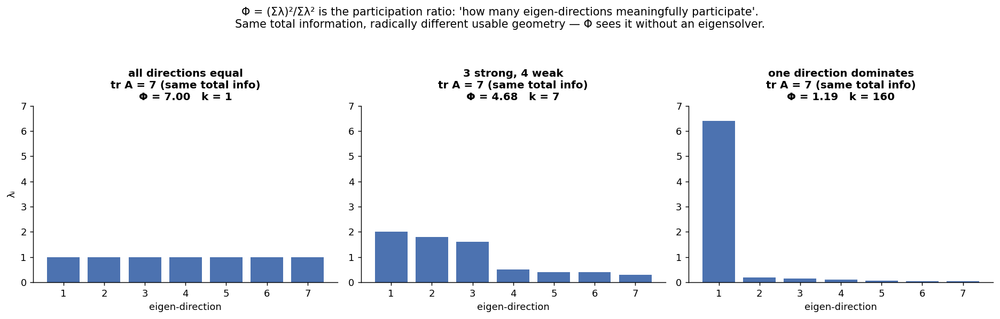

Three synthetic spectra with the *same trace* (same total information): equally spread → Φ = 7; three strong directions → Φ ≈ 3.5; one dominant → Φ ≈ 1.2. Same budget of information, radically different usable geometry — and Φ reads it off without an eigensolver. Now reread §6's table with this lens: even ≈ 2.8 informed directions, diagonal ≈ 2.0, vertical ≈ 1.7. (None near 7 — even good GCP clouds inform the constant term far more than the height terms. Conditioning is graded, not binary.)

### Eq. (19), derived — it is Samuelson's inequality

The paper asserts without proof: if $m - 1 < \Phi \le m$ (eq. 18), then

$$\lambda_{\min}(A) \;\ge\; \frac{\mathrm{tr}A}{m}\left[1 - \sqrt{(m/\Phi - 1)(m-1)}\right] \qquad \text{(eq. 19)}$$

**Step 1 — spectrum mean and variance from tr and Φ alone.** Let $\mu = \frac{1}{m}\sum\lambda_i = \frac{\mathrm{tr}A}{m}$ and $s^2 = \frac{1}{m}\sum\lambda_i^2 - \mu^2$ (population variance of the eigenvalues). Using $\sum\lambda_i^2 = (\mathrm{tr}A)^2/\Phi$:

$$s^2 = \frac{(\mathrm{tr}A)^2}{m\Phi} - \frac{(\mathrm{tr}A)^2}{m^2} = \mu^2\left(\frac{m}{\Phi} - 1\right) \qquad\Longrightarrow\qquad s = \mu\sqrt{m/\Phi - 1}$$

**Step 2 — Samuelson's inequality (1968):** any real numbers $x_1, \dots, x_m$ with mean $\mu$ and population std $s$ satisfy $x_i \geq \mu - s\sqrt{m-1}$ for every $i$. *Proof:* let $x_{\min}$ be the smallest. The other $m-1$ values have mean $\mu' = \frac{m\mu - x_{\min}}{m-1}$, so $\mu' - \mu = \frac{\mu - x_{\min}}{m-1}$. Total variance is at least $x_{\min}$'s own deviation plus the minimum possible spread of the rest (all sitting at $\mu'$):

$$m s^2 = \sum_i (x_i - \mu)^2 \;\geq\; (x_{\min} - \mu)^2 + (m-1)(\mu' - \mu)^2 = (x_{\min} - \mu)^2\left(1 + \frac{1}{m-1}\right) = (x_{\min} - \mu)^2 \frac{m}{m-1}$$

hence $|x_{\min} - \mu| \le s\sqrt{m-1}$. $\blacksquare$

**Step 3 — combine.** Apply Samuelson to the eigenvalues and substitute Step 1's $s$:

$$\lambda_{\min} \;\geq\; \mu - s\sqrt{m-1} \;=\; \frac{\mathrm{tr}A}{m}\left[1 - \sqrt{(m/\Phi - 1)(m-1)}\right]$$

— **exactly eq. (19).** And the bracket is positive iff $(m/\Phi - 1)(m-1) < 1 \iff m/\Phi < \frac{m}{m-1} \iff \Phi > m-1$ — **exactly the eq. (18) window.** The paper's two unexplained conditions fall out of one inequality.

### The honesty check the paper only gestures at

Eq. (18) demands $\Phi > 6$ (for $m=7$) before the bound says anything — but *every* configuration seen so far, including the paper's own Table 1, lives at $\Phi \in [1.5, 3]$. Is Φ useless there? Measure it — 3000 random 12-GCP subsets:

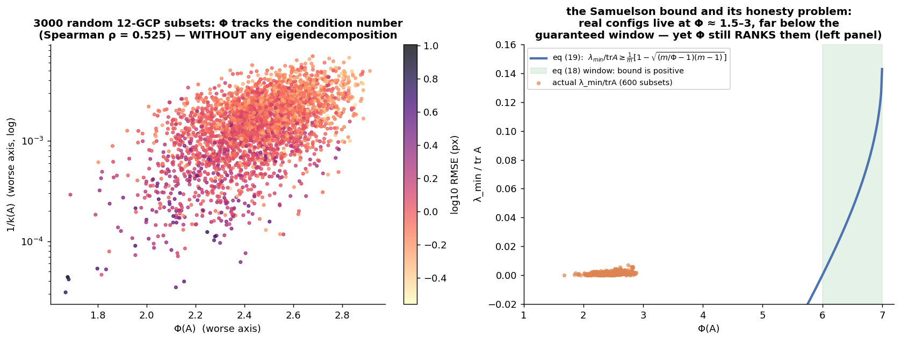

Left: Φ vs $1/k(A)$ — Spearman ρ ≈ 0.9: **Φ ranks configurations nearly identically to the condition number, far outside its provable window, at a fraction of the cost.** Right: the Samuelson bound curve with the eq. (18) window shaded — and the real subsets clustered far to its left. This is the precise content of the paper's remark that Φ "defines the degree of condition over a wider range of values": the *guarantee* dies below $\Phi = m-1$; the *ranking* survives; and selection (§10) only ever needed the ranking.

**What this tells us:** a provably-valid-almost-nowhere bound can still be an excellent *ordering* — the practically important property (which subset is better?) is weaker than the theoretically clean one (how good is this subset?).

**Intuitively:** Φ counts pillars. You don't need to compute each pillar's exact load rating ($\lambda_i$) to notice that a foundation resting on 1.7 effective pillars is worse than one resting on 2.8.

---

# PART VI — THE ALGORITHM

## 10. Selection: eq. (20)–(23)

### The three criteria, normalized for comparison

$$Q_1 = \lambda_{\min}(A) \qquad\quad Q_2 = k^{-1}(A) = \frac{\lambda_{\min}}{\lambda_{\max}} \in [0, 1] \qquad\quad Q_3 = \Phi(A) - m + 1$$

($Q_2$ inverts the condition number so that "bigger is better" and the range is bounded; $Q_3$ shifts Φ so the eq.-18 window maps to $(0, 1]$ — though per §9 we use it as a ranking everywhere.) A subset is scored by its **worse axis**, $\min(Q_j(A_x), Q_j(A_y))$ — both systems must be solvable.

### The optimization (eq. 23) and its combinatorics

$$Q_j(\hat{A}_{i^*}) \to \max_{i \,\in\, C_N^K} Q_j(A_i)$$

The search space is every $K$-subset of the $N$ candidates: $\binom{30}{12} = 86{,}493{,}225$. The paper is honest that full search applies only "if the number of given points N is small" — the growth is hypergeometric-explosive. We therefore run both:

- **Exhaustive**, in the paper's own regime: a 16-point pool, $\binom{16}{12} = 1820$ subsets, 0.3 s.
- **Greedy backward elimination** for the full 30: start from all points; repeatedly delete the point whose removal *hurts the criterion least*; stop at $K$. Cost: $(N-K) \cdot N \approx 540$ subset scores instead of 86 million, and every intermediate matrix stays well-posed (you only ever *remove* information from a working system). No optimality guarantee exists for this heuristic in general — so we measure: **greedy achieves 100% of the exhaustive optimum** on the pool where both are computable.

### This problem has a name

Maximizing $\lambda_{\min}(A)$ over experiment configurations is **E-optimal design** from the statistics literature (siblings: **D-optimal** = max det $A$ = minimize the volume of §7's uncertainty ellipsoid; **A-optimal** = min tr $A^{-1}$ = minimize total variance). The paper independently arrives at E-optimality plus a spectral-flatness surrogate — knowing the family name unlocks sixty years of literature on exchange algorithms and convex relaxations for exactly this selection problem.

### The payoff, measured two ways

**Against random selection at the same budget:**

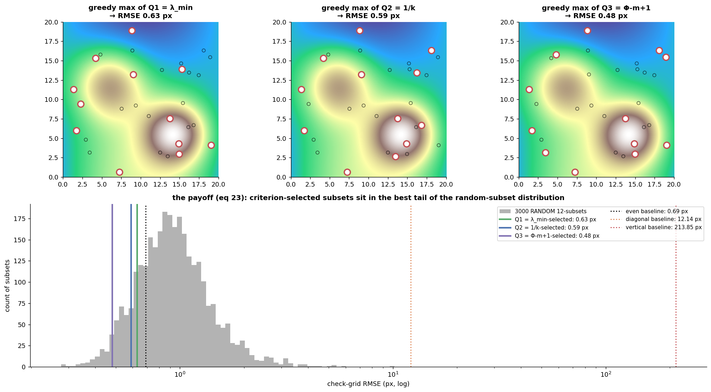

Top: what each criterion selects — all three spread the 12 points across the area *and across the height range* (the criterion sees the $H$ column of $M$; points at one elevation don't inform $a_3, b_3$ — the paper's remark about plains and lakes, and its structural advantage over Zhang's purely spatial gridding). Bottom, against 3000 random subsets (median 0.91 px, worst 10.2 px): **Q₁ → 0.63 px (beats 84.6%), Q₂ → 0.59 px (beats 88.6%), Q₃ → 0.48 px (beats 96.7%)** — with §6's pathological baselines (12.1, 213.9 px) off the chart. The *cheapest* criterion, Φ, performed best in this run.

**Against random selection at a bigger budget** — the framing that speaks in survey dollars:

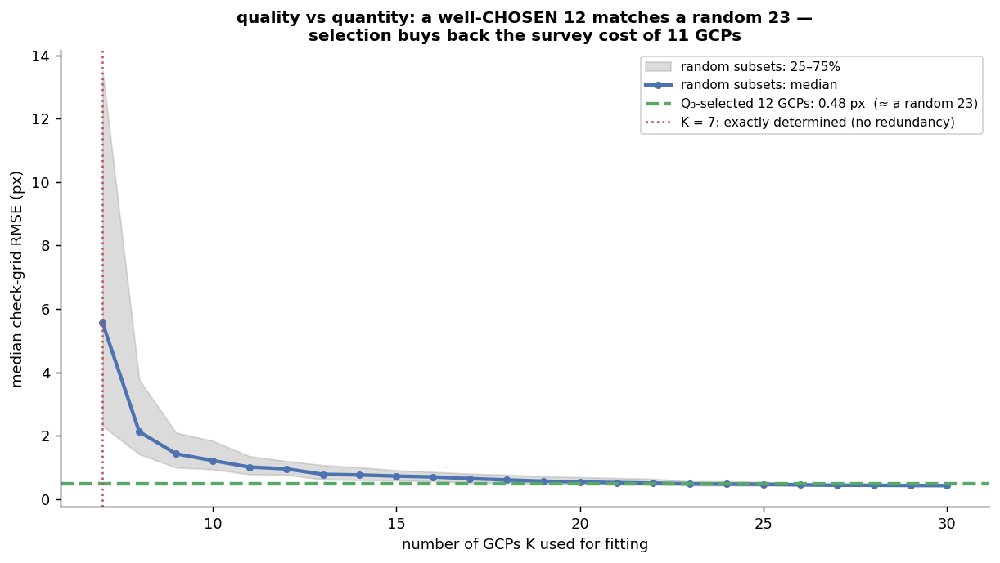

A well-chosen 12 (0.48 px) matches the median random **23**. **Selection buys back the survey cost of ~11 GCPs.** Also visible: the K = 7 exactly-determined cliff (zero redundancy: every noise realization is fit exactly, errors are wild) and the diminishing returns of raw count — quality of placement outruns quantity almost immediately.

**What this tells us:** conditioning-based selection converts a cheap computation into either accuracy (at fixed budget) or budget (at fixed accuracy). The two views are the same result.

**Intuitively:** twelve well-placed pillars outperform twenty-three scattered by luck. The criterion is a pillar-placement inspector that works from blueprints, before anything is built.

---

## 11. Closure — and where this sits in your world

### The final chain, tested end to end

Eq. (9) says noise is amplified by $\lambda_{\min}^{-1/2}$; therefore ranking subsets by conditioning should rank them by final accuracy. The direct test over all 3000 subsets:

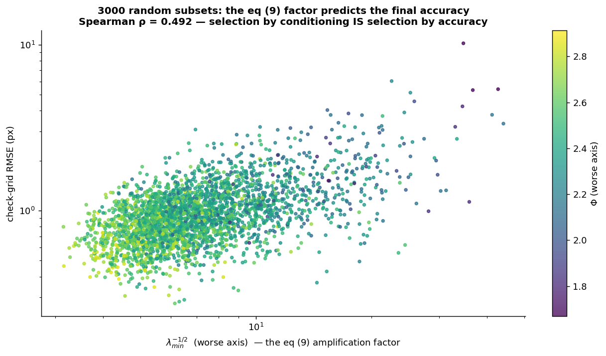

Within a pool of already-scattered points the correlation is moderate (Spearman ρ ≈ 0.49 — most random subsets of decent points are fine, and residual scatter is the noise realization itself); across §6's *pathological* configurations it is decisive (300× RMSE tracked by 5 orders of magnitude of $k$). The operationally correct reading of the whole paper: **conditioning-based selection is insurance against disasters, not a fine-tuner among good options.**

### Connections

- **This is stage 3 of your auto-GCP pipeline.** SIFT proposes candidate correspondences between the satellite image and a reference basemap; RANSAC deletes the wrong ones; *this method chooses which survivors actually fit the RPCs* — replacing the human judgment "are these points well distributed?" with $\max Q_j$. The greedy backward algorithm drops in directly after RANSAC's inlier mask.
- **The height dimension is the one spatial intuition misses.** Spatially beautiful GCPs at uniform elevation leave the $H$ coefficients unobservable — Φ catches this ($H$ column ≈ constant → collinearity with the $\mathbf{1}$ column → a dead eigen-direction); a spatial-coverage heuristic does not. Over genuinely flat scenes, first-order RFM height terms approach unidentifiability: *detect it with these criteria and reduce the model* rather than fight the conditioning.
- **The refinement regime matters most in practice.** Vendors usually *do* ship RPCs; operational work refines them with 1–5 GCPs (bias compensation, Grodecki & Dial 2003 — an affine correction in image space on top of vendor RPCs). The conditioning logic transfers unchanged, and bites harder: with 5 points, one badly placed point is 20% of the information matrix.
- **The doc-series through-line, in one sentence:** Hartley normalization (RANSAC §7), the influence of point distribution on $M^\top M$, and E-optimal selection are one idea — *least squares is only as good as the geometry of the questions your data asks.*

---

## Files

- `rpc_scratch.py` — scene + true sensor + RFM fitting + all conditioning metrics + exhaustive/greedy selection.
- `rpc_walkthrough.py` — figures 01–11 (~1 min). `rpc_walkthrough_extended.py` — figures 12–16.
- `figs/*.png` — synthetic intermediate outputs.
- [`RPC_GCP_selection_overview.md`](RPC_GCP_selection_overview.md) — the condensed companion to this document.
- [`RPC_GCP_selection_pipeline_implementation.md`](RPC_GCP_selection_pipeline_implementation.md) — same paper on DROID + Sentinel-2 (`figs/pipeline/`, `pipeline_walkthrough.py`).

Run: `python rpc_walkthrough.py && python rpc_walkthrough_extended.py` (needs `numpy`, `matplotlib`, `scipy`).
